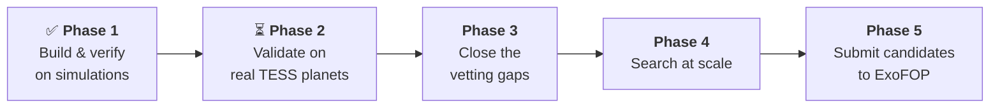
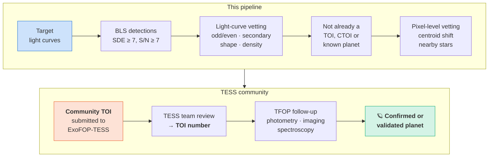

# TESS Transit Hunter

[](https://github.com/comdex4/tess-transit-hunter/actions/workflows/ci.yml)


A Python research pipeline that **finds, fits, and vets transiting exoplanets in NASA TESS
2-minute light curves**. For one TIC target it:

1. downloads every SPOC 2-minute PDCSAP sector, removes flagged and NaN cadences, clips
   upward outliers, and caches the result (`data.py`);
2. removes stellar variability with a robust windowed biweight filter, masking known
   transits when requested (`detrend.py`);
3. runs an **iterative Box Least Squares search** over a physically bounded period ×
   duration grid, with red-noise-aware S/N, SDE, and trial-corrected thresholds
   (`search.py`);
4. fits each detection with a **batman** transit model sampled by **emcee**, reports
   posterior medians and 68 % intervals, and derives the planet radius from the TIC stellar
   radius (`fit.py`);
5. applies **vetting tests** for eclipsing binaries: odd/even depths, a secondary eclipse at
   phase 0.5 (and at any phase), V- versus U-shape, transit-implied versus catalogue stellar
   density, radius, and transits that fall only at the edges of data segments; candidates
   at the star's rotation period get a warning (`vet.py`);
6. measures **completeness** by injection–recovery over a period × radius grid, in
   parallel (`inject.py`).

Full write-up (methods, validation, completeness, candidate verdicts, limitations):
**<https://comdex4.github.io/tess-transit-hunter/>** (source in [`docs/`](docs/)).

## Status of the results

<!-- BEGIN: status -->

| analysis | needs | status |
|---|---|---|
| False-alarm calibration (synthetic noise) | offline (synthetic data) | done |
| End-to-end benchmark on synthetic systems | offline (synthetic data) | done |
| Injection–recovery on a synthetic light curve | offline (synthetic data) | done |
| Validation on confirmed TESS planets | MAST + Exoplanet Archive | done |
| Vetting of TOI planet candidates | MAST + Exoplanet Archive | **not yet run** (needs network access) |
| Injection–recovery on a real TESS light curve | MAST + Exoplanet Archive | **not yet run** (needs network access) |

The analyses still to run use the TESS archives: `mast.stsci.edu` (TESS light curves, TIC) and `exoplanetarchive.ipac.caltech.edu` (reference values, TOI catalogue). Their code is tested offline against synthetic data and mocked archive responses. The result tables, figures, and summary numbers on these pages are copied from `results/` by `scripts/update_docs.py`, not typed by hand.

<!-- END: status -->

### What the real data showed

- **9 of 10 confirmed planets recovered** around five stars (WASP-18, pi Men, TOI-270,
  L 98-59, HD 21749), from a 0.94-day hot Jupiter to L 98-59 b, which is smaller than
  Earth (0.86 R⊕). For eight of the nine, the fitted radius ratio is within 8 % of the
  published value (median 3.5 %).
- **The failures are the most instructive.** HD 21749 c (0.89 R⊕) is in the data at
  S/N 16.6 but was missed: a few deep instrumental dips at the edges of data segments
  swamp the periodogram. A single transit on an instrumental ramp makes HD 21749 b fail
  the odd/even test. TOI-270 d fails the stellar-density test for reasons not yet
  established.
- **Real impostors are caught.** Three detections match no known planet or TOI, and the
  vetting rejects all three. They include a 1.049-day eclipsing binary in L 98-59's light
  curve, with a 37 ppm secondary eclipse and a transit-implied density a tenth of the
  star's. WASP-18 b's own occultation (356 ± 11 ppm) is kept as planetary.

Details, with every number traced to `results/`, are on the
[validation page](https://comdex4.github.io/tess-transit-hunter/validation.html#what-the-real-data-showed).

### End-to-end benchmark on synthetic systems (truth known)

Simulated TESS-like light curves go through the full pipeline (detrend, iterative BLS,
MCMC, vetting). They cover a hot Jupiter, a small planet around a bright star observed for
six sectors, a three-planet M-dwarf system, and a long-period planet, plus an eclipsing
binary as a negative control. These are **simulations, not TESS data**; the "published"
columns hold the injected (true) values.

<!-- BEGIN: benchmark -->

| planet | P published (d) | P recovered (d) | ΔP | depth published (ppm) | depth recovered (ppm) | Δdepth | Rp published (R⊕) | Rp recovered (R⊕) | ΔRp |
|---|---|---|---|---|---|---|---|---|---|
| SYN-1 b | 0.940000 | 0.940000 ± 8.8e-07 | -0.0000% | 9091 | 9074 ± 36 | -0.2% | 13.00 | 12.98 ± 0.39 | -0.1% |
| SYN-2 b | 6.270000 | 6.270082 ± 5e-05 | +0.0013% | 278 | 268 ± 23 | -3.7% | 2.00 | 1.98 ± 0.1 | -1.2% |
| SYN-3 b | 3.360000 | 3.359982 ± 6.5e-05 | -0.0005% | 984 | 1148 ± 85 | +16.7% | 1.30 | 1.40 ± 0.067 | +8.0% |
| SYN-3 c | 5.660000 | 5.660025 ± 4.9e-05 | +0.0004% | 3353 | 3313 ± 1.1e+02 | -1.2% | 2.40 | 2.39 ± 0.082 | -0.4% |
| SYN-3 d | 11.380000 | 11.379804 ± 0.00022 | -0.0017% | 2567 | 2771 ± 2.7e+02 | +8.0% | 2.10 | 2.19 ± 0.12 | +4.1% |
| SYN-4 b | 35.600000 | 35.599620 ± 0.00021 | -0.0011% | 1345 | 1409 ± 62 | +4.8% | 2.80 | 2.87 ± 0.11 | +2.4% |

Depth is the geometric depth (Rp/R*)² unless noted; Δ = 100 × (recovered − published) / published.


| system | description | sectors | detections | vetting verdicts |
|---|---|---|---|---|
| SYN-1 | hot Jupiter on a sub-day orbit around an F star | 2 | 1 | planet candidate (passes all tests) |
| SYN-2 | small planet around a bright, quiet G dwarf observed for six sectors | 6 | 1 | planet candidate (passes all tests) |
| SYN-3 | compact three-planet system around an M dwarf | 3 | 3 | planet candidate (passes all tests); planet candidate (passes all tests); planet candidate (passes all tests) |
| SYN-4 | long-period sub-Neptune around a K dwarf (six contiguous sectors) | 6 | 1 | planet candidate (passes all tests) |
| SYN-5 | eclipsing binary found at half its period (negative control) | 2 | 1 | likely false positive |


<!-- END: benchmark -->

### Completeness (injection–recovery)

<!-- BEGIN: completeness_summary -->

2048 injections (0.7–8 R⊕, 0.5–20 d) into a synthetic TESS-like light curve of a G dwarf: 38020 points over 54.8 days; robust scatter of the flattened light curve 0.5h: 185 ppm, 1h: 140 ppm, 2h: 99 ppm. Overall recovery: 71.7 %; 0 injections were found only at an alias period.


<!-- END: completeness_summary -->

**How to read the map:** everything larger than about 2.4 R⊕ is found almost every time
out to 20 days. Earth-sized planets (0.95–1.3 R⊕) are recovered 72 % of the time on
sub-day orbits but essentially never beyond 5 days on this star with two sectors of data. That
boundary is set by how many transits are stacked and how noisy the star is, and it moves
outward with more sectors, a quieter star, or a smaller star. The per-cell table and the
real-light-curve version are on the
[completeness page](https://comdex4.github.io/tess-transit-hunter/completeness.html).

### False-alarm calibration

<!-- BEGIN: calibration -->

Noise-only synthetic light curves (no transits), 150 per case, searched without a stellar-density prior (the widest duration grid). A false alarm is a strongest peak with SDE ≥ 7, S/N at or above the applied threshold (the larger of 7 and the trial-corrected 1 % level), and at least two transits. In brackets: false alarms that the vetting would flag as lying at the star's rotation period, half of it, or twice it (Lomb–Scargle of the un-detrended light curve). The last column counts light curves in which at least one stronger peak was skipped as stellar variability before the strongest peak was chosen.

| noise regime | sectors | median 1-h CDPP (ppm) | SDE median / 99th pct / max | S/N median / 99th pct / max | S/N threshold applied | false alarms (at P_rot) | peaks skipped as variability |
|---|---|---|---|---|---|---|---|
| quiet | 1 | 59 | 4.9 / 6.6 / 8.1 | 5.3 / 7.0 / 7.3 | 7.00 | 1/150 (0) | 20/150 |
| moderate | 1 | 173 | 4.3 / 6.3 / 6.7 | 4.9 / 9.1 / 11.6 | 7.00 | 0/150 (0) | 22/150 |
| active | 1 | 873 | 2.8 / 5.2 / 5.5 | 5.1 / 19.1 / 21.8 | 7.00 | 0/150 (0) | 91/150 |
| moderate | 3 | 170 | 5.0 / 8.0 / 8.6 | 6.1 / 11.5 / 13.8 | 7.00 | 11/150 (10) | 95/150 |


<!-- END: calibration -->

### Search cost

<!-- BEGIN: performance -->

One BLS iteration on noise-only synthetic light curves, 4 worker processes (x86_64, 4 CPUs).

| data | ρ* known | points | trial periods | effective trials | S/N threshold (trial-corrected 1 %) | time per iteration (s) | top noise peak S/N / SDE |
|---|---|---|---|---|---|---|---|
| 1 sector (27 d) | yes | 19010 | 12041 | 2.8e+05 | 7.00 (5.86) | 0.5 | 5.7 / 3.8 |
| 3 sectors (82 d) | yes | 57028 | 42991 | 1.5e+06 | 7.00 (6.14) | 2.3 | 5.9 / 4.9 |
| 13 sectors (356 d) | yes | 247108 | 214269 | 1.3e+07 | 7.00 (6.48) | 24 | 5.6 / 6.9 |
| 26 sectors over 3 years (1086 d) | yes | 494212 | 694018 | 7.1e+07 | 7.00 (6.74) | 125 | 5.8 / 6.1 |
| 26 sectors over 3 years (1086 d) | no | 494212 | 1015247 | 2.2e+08 | 7.00 (6.90) | 540 | 6.0 / 7.7 |

Peaks skipped as stellar variability before the top peak was chosen:

* 1 sector (ρ* known): P = 0.59 d, SDE 4.5: folded light curve also brightens (4.4 sigma, against 4.9 sigma for the dip): stellar variability
* 26 sectors over 3 years (ρ* known): P = 12.03 d, SDE 7.7: folded light curve also brightens (7.0 sigma, against 8.6 sigma for the dip): stellar variability
* 26 sectors over 3 years (ρ* known): P = 0.55 d, SDE 6.9: folded light curve also brightens (4.1 sigma, against 6.0 sigma for the dip): stellar variability
* 26 sectors over 3 years (ρ* unknown): P = 6.01 d, SDE 8.9: folded light curve also brightens (6.3 sigma, against 8.4 sigma for the dip): stellar variability
* 26 sectors over 3 years (ρ* unknown): P = 12.03 d, SDE 7.7: folded light curve also brightens (7.0 sigma, against 8.6 sigma for the dip): stellar variability

<!-- END: performance -->

### Confirmed TESS planets

<!-- BEGIN: validation -->

| planet | P published (d) | P recovered (d) | ΔP | depth published (ppm) | depth recovered (ppm) | Δdepth | Rp published (R⊕) | Rp recovered (R⊕) | ΔRp |
|---|---|---|---|---|---|---|---|---|---|
| WASP-18 b | 0.941452 | 0.941452 ± 1e-08 | +0.0000% | 10363 | 9777 ± 27 | -5.7% | 13.90 ± 0.89 | 14.51 ± 0.74 | +4.4% |
| pi Men c | 6.267840 | 6.267822 ± 1e-06 | -0.0003% | 251 | 275 ± 9.6 | +9.6% | 2.02 ± 0.046 | 2.08 ± 0.09 | +3.2% |
| TOI-270 b | 3.359920 | 3.360163 ± 8.6e-07 | +0.0072% | 942 | 1009 ± 57 | +7.1% | 1.28 ± 0.045 | 1.30 ± 0.055 | +1.4% |
| TOI-270 c | 5.660510 | 5.660478 ± 1.1e-06 | -0.0006% | 3136 | 3651 ± 6e+02 | +16.4% | 2.33 ± 0.01 | 2.46 ± 0.21 | +5.5% |
| TOI-270 d | 11.381940 | 11.379700 ± 4.4e-06 | -0.0197% | 2411 | 3483 ± 1.9e+02 | +44.5% | 2.00 ± 0.05 | 2.41 ± 0.099 | +20.6% |
| L 98-59 b | 2.253114 | 2.253114 ± 3.4e-07 | +0.0000% | 666 | 628 ± 27 | -5.7% | 0.84 ± 0.019 | 0.86 ± 0.031 | +2.7% |
| L 98-59 c | 3.690676 | 3.690675 ± 4.1e-07 | -0.0000% | 1568 | 1618 ± 1.2e+02 | +3.2% | 1.33 ± 0.029 | 1.38 ± 0.064 | +3.6% |
| L 98-59 d | 7.450729 | 7.450729 ± 1.4e-06 | +0.0000% | 2116 | 2050 ± 2.4e+02 | -3.1% | 1.63 ± 0.041 | 1.55 ± 0.1 | -4.6% |
| HD 21749 c | 7.789930 | not recovered | | 143 | | | 0.89 | | |
| GJ 143 b | 35.612530 | 35.613408 ± 2.4e-05 | +0.0025% | 1225 | 1425 ± 1.6e+02 | +16.3% | 2.61 ± 0.17 | 2.91 ± 0.3 | +11.5% |

Depth is the geometric depth (Rp/R*)² unless noted; Δ = 100 × (recovered − published) / published.

| host | sectors | signal | P (d) | S/N | known as | vetting verdict | failed tests / warnings |
|---|---|---|---|---|---|---|---|
| WASP-18 | 10 | 1 | 0.94145 | 789.0 | WASP-18 b | planet candidate (passes all tests) | – |
| WASP-18 | 10 | 2 | 0.94145 | 39.0 | – | occultation of signal 1 (phase 0.50), consistent with a planet | – |
| pi Men | 24 | 1 | 6.26781 | 106.6 | pi Men c | planet candidate (passes all tests) | – |
| TOI-270 | 7 | 1 | 5.66048 | 89.1 | TOI-270 c | planet candidate (with caveats) | warnings: rotation |
| TOI-270 | 7 | 2 | 11.37971 | 55.2 | TOI-270 d | likely false positive | failed: density; warnings: rotation |
| TOI-270 | 7 | 3 | 3.36016 | 31.2 | TOI-270 b | planet candidate (passes all tests) | – |
| TOI-270 | 7 | 4 | 56.36665 | 11.9 | no confirmed planet or TOI | likely false positive | failed: coverage; warnings: shape |
| L 98-59 | 27 | 1 | 3.69068 | 132.0 | L 98-59 c | planet candidate (passes all tests) | – |
| L 98-59 | 27 | 2 | 7.45073 | 65.1 | L 98-59 d | planet candidate (passes all tests) | – |
| L 98-59 | 27 | 3 | 2.25312 | 62.5 | L 98-59 b | planet candidate (passes all tests) | – |
| L 98-59 | 27 | 4 | 1.04918 | 36.7 | no confirmed planet or TOI | likely false positive | failed: secondary, density |
| L 98-59 | 27 | 5 | 0.52460 | 9.3 | – | secondary eclipse of an eclipsing binary (with signal 4, phase 0.50) | – |
| HD 21749 | 15 | 1 | 35.61342 | 62.4 | GJ 143 b | likely false positive | failed: odd_even, secondary |
| HD 21749 | 15 | 2 | 193.09210 | 73.7 | no confirmed planet or TOI | likely false positive | failed: secondary, radius, coverage; warnings: shape |

Known as: the confirmed planet (NASA Exoplanet Archive) or, failing that, the TOI and its TFOPWG disposition with the same period to within 1 %.


Confirmed planets that the search missed, measured at their published ephemeris in the light curve of the search's last pass (`scripts/check_missed_planets.py`):

| planet | P (d) | published depth (ppm) | box depth at the published ephemeris (ppm) | transits with data | red-noise S/N (threshold) | search stopped at |
|---|---|---|---|---|---|---|
| HD 21749 c | 7.78993 | 143 | 168 | 45 | 16.6 (7.00) | pass 3: P = 139.05 d, SDE 5.9 |

<!-- END: validation -->

### TOI planet candidates

<!-- BEGIN: candidates -->

> **Not yet run.** Vetting of TOI planet candidates; it requires network access to `mast.stsci.edu` (light curves, TIC) and `exoplanetarchive.ipac.caltech.edu` (reference values, TOI catalogue).
>
> Generate it with `python scripts/vet_toi_candidates.py`, then run `python scripts/update_docs.py`.

<!-- END: candidates -->

---

## Installation and usage

Python ≥ 3.11.

```bash
git clone https://github.com/comdex4/tess-transit-hunter.git
cd tess-transit-hunter
pip install -e ".[dev]"          # add ,notebook for the Jupyter notebook
```

Dependencies: numpy, scipy, astropy (BoxLeastSquares), astroquery (NASA Exoplanet Archive,
TIC), lightkurve, batman-package, emcee, corner, matplotlib, and wotan (biweight
detrending).

### Command line

```bash
# Full pipeline for one star: all 2-min sectors, search, MCMC fits, vetting, report folder
transit-hunter run --tic 261136679 --outdir reports/

# Useful options
transit-hunter run --tic 261136679 --sectors 1 4 13 --window 1.0 --max-period 30 \
    --max-signals 3 --quick --workers 8

# Download, clean, and cache only
transit-hunter fetch --tic 261136679

# Offline demo on a synthetic three-planet M-dwarf system (no network needed)
transit-hunter demo --outdir reports/
```

Each run writes `reports/TIC<ID>/` containing:

| file | contents |
|---|---|
| `report.json` | every number: target, stellar parameters, noise, all search iterations, posterior summaries, derived quantities, vetting tests, configuration, software versions, data provenance |
| `summary.md` | human-readable summary with the vetting reasoning |
| `detrending.png` | raw flux with trend, flattened flux (one row per observing season) |
| `search_summary.png`, `periodogram_<n>.png`, `fold_<n>.png` | BLS periodograms and phase-folded light curves per iteration |
| `fit_<n>.png`, `corner_<n>.png` | best-fitting model with residuals; posterior corner plot |
| `vetting_<n>.png` | odd/even, phase 0.5, transit shape, stellar density |

A complete example report folder is in
[`results/synthetic_benchmark/SYN-3/`](results/synthetic_benchmark/SYN-3/) (start with its
[`summary.md`](results/synthetic_benchmark/SYN-3/summary.md)).

Downloads need network access to `mast.stsci.edu`. Stellar parameters come from the TIC via
MAST, falling back to the values in the FITS header. Processed light curves are cached in
`~/.cache/transit_hunter` (override with `TRANSIT_HUNTER_CACHE` or `--cache-dir`).

### Python

```python
from transit_hunter.data import fetch_lightcurve
from transit_hunter.catalog import get_stellar_params
from transit_hunter.pipeline import PipelineConfig, run_on_lightcurve

lc = fetch_lightcurve(261136679)                       # cleaned, stitched, cached
star = get_stellar_params(261136679, lc.meta["stellar_header"])
report = run_on_lightcurve(lc, "reports/pi_Men", star, PipelineConfig(), name="pi Men")
```

The pieces can also be used on their own: `detrend.detrend`, `search.iterative_search`,
`fit.fit_transit`, `vet.run_vetting`, and `inject.run_injections`.

### Analysis scripts

| script | what it produces | needs network |
|---|---|---|
| `scripts/validate_known_planets.py` | recovered vs published P, depth, Rp for confirmed planets (plus [notebook](notebooks/validation_known_planets.ipynb)) | yes |
| `scripts/vet_toi_candidates.py` | pipeline + vetting verdicts for 3–5 PC TOIs with 2-min data | yes |
| `scripts/run_injection_recovery.py --tic <ID> --mask-known` | completeness map for a real light curve (its known planets masked) | yes |
| `scripts/run_injection_recovery.py --synthetic` | completeness map for a synthetic light curve | no |
| `scripts/run_synthetic_benchmark.py` | end-to-end test on synthetic systems with known truth | no |
| `scripts/calibrate_false_alarms.py` | false-alarm rate on noise-only light curves | no |
| `scripts/benchmark_search_scaling.py` | search cost versus amount of data | no |
| `scripts/update_docs.py` | copies result tables and figures into this README and `docs/` | no |
| `scripts/make_readme_figures.py` | the two explanatory diagrams at the top of this README | no |
| `scripts/make_site_figures.py` | the explanatory figures on the documentation site's pipeline pages | no |

---

## Roadmap



**Phase 1: build and verify on simulations (done).**

- [x] Data download, cleaning, caching and detrending
- [x] Iterative BLS with physical grids, red-noise S/N and trial-corrected thresholds
- [x] batman + emcee fitting with derived planet properties
- [x] Six-test eclipsing-binary vetting with verdicts
- [x] Parallel, resumable injection–recovery
- [x] Synthetic benchmark, false-alarm calibration, search-cost benchmark
- [x] CLI, report folders, CI, auto-generated documentation

**Phase 2: validate on real TESS data (next; the code is written, it needs network access).**

- [x] Recover published period, depth and radius for confirmed TESS planets
  (`validate_known_planets.py`): 9 of 10 found around five stars
- [x] A data-coverage vetting test, added after the first real run produced a false alarm
  made of events at the edges of data segments
- [ ] Real-light-curve injection–recovery, which will be less optimistic than the synthetic map
- [ ] Verdicts on 3–5 unresolved TOI planet candidates (`vet_toi_candidates.py`)
- [ ] Re-calibrate the false-alarm thresholds on real, planet-free light curves, which contain
  momentum dumps, scattered light and other systematics the simulator lacks

**Phase 3: close the vetting gaps.**

- [ ] **Pixel-level centroid test** from target-pixel files: does the star's image shift during
  transit? That is the signature of a background binary, the largest class of false positive
  this pipeline cannot currently catch
- [ ] **Statistical validation** with a false-positive-probability tool such as TRICERATOPS,
  combining the light curve with the star's neighbourhood and Gaia data
- [ ] Reject single transits hit by instrumental systematics before vetting (one such
  transit makes HD 21749 b fail the odd/even test)
- [ ] Mask deep, isolated dips before the search (they hid HD 21749 c, which is in the data
  at S/N 16.6)
- [ ] Limb-darkening priors from stellar-atmosphere tables; eccentric-orbit fits
- [ ] Calibrate the vetting thresholds on a labelled sample of known planets and known false
  positives from the TOI catalogue (two of nine recovered confirmed planets fail a test)

**Phase 4: search at scale.**

- [ ] Batch mode over target lists (for example every 2-minute M dwarf in a sky region), with a
  ranked candidate table instead of one folder per star
- [ ] **Full-frame-image light curves** (TESS-SPOC / QLP): millions of stars observed at
  10- or 30-minute cadence that never got a 2-minute slot
- [ ] Transit Least Squares (limb-darkened template) as a second search engine, and a GPU BLS
  for multi-year baselines
- [ ] **Single- and duo-transit search** for long-period planets that transit once per year
  of TESS coverage
- [ ] Transit-timing-variation search for planets tugged by unseen companions
- [ ] Automatic cross-match against the TOI, CTOI and confirmed-planet catalogues so that
  anything left over is flagged as new

**Phase 5: submit.** Package surviving candidates (ephemeris, depth, vetting report, figures) as
Community TOIs on ExoFOP-TESS. See the next section.

---

## Could this find a new exoplanet?

Yes, in principle. Amateurs and students have done it: citizen-science projects such as
Planet Hunters TESS have turned up candidates the automated pipelines missed, and anyone can
submit a candidate to NASA's follow-up program. But a periodic dip is not a planet, and the path
from one to the other is long. This is what it would take.

### Where undiscovered planets are still hiding in TESS data

The official pipelines (SPOC and MIT's QLP) are excellent, but they are general-purpose and
work at huge scale. Planets slip through in predictable places:

| hiding place | why the official search can miss it | what this pipeline would need |
|---|---|---|
| **Additional planets in known systems** | after the obvious planet is found, fainter siblings can go unsearched | already does iterative masked search; run it on TOI hosts |
| **Stars with many sectors** (near the ecliptic poles) | small planets only emerge after stacking years of data | multi-year period grid already built; needs compute time |
| **Active, spotted stars** | aggressive stellar variability defeats generic detrending | biweight + spot-rejection test; tune per star |
| **Long periods** (> ~50 days) | only one or two transits, often in different years | Phase 4 duo-transit search |
| **Faint stars with only full-frame images** | lower priority for the 2-minute pipeline | Phase 4 FFI support |

Small **M-dwarf hosts** are the best bet: the
[transit-depth figure](docs/assets/readme/depth_vs_radius.png) shows that an Earth-sized
planet around a 0.38 R☉ star makes a ~580 ppm dip, 7× deeper than around the Sun. Those planets are also the best targets for atmosphere studies with JWST.

### The discovery funnel



The first three boxes are what this repository does today. The catalogue cross-match is a small
addition. Pixel-level vetting is the biggest missing piece: without centroid analysis, a background eclipsing binary diluted into the
target's pixels looks exactly like a planet. After that, the process runs through the TESS
community:

1. **Submit a CTOI.** Anyone who finds a planet candidate in TESS data can submit it to
   [ExoFOP-TESS](https://exofop.ipac.caltech.edu/tess/) as a Community TOI. The TESS TOI team
   reviews it and, if it meets their standard, gives it a TOI number
   ([TOI release FAQ](https://tess.mit.edu/toi-releases/toi-release-faqs/)).
2. **Follow-up.** The TESS Follow-up Observing Program (TFOP) coordinates ground-based
   photometry (is the dip on the target star?), high-resolution imaging (is there a hidden
   companion star?) and spectroscopy (is the host a single star, and what is the planet's mass?).
3. **Confirmation or validation.** A radial-velocity mass measurement confirms a planet. Where
   that is out of reach, a statistical false-positive probability below ~1 % can "validate" it.

### What a credible first result would look like

The realistic near-term goal is not a headline discovery. It is a pipeline that (1) recovers
known TESS planets to within their published uncertainties, (2) independently agrees with the
TESS team's verdicts on TOIs that have already been resolved, and then (3) produces a short,
ranked list of new candidates around nearby M dwarfs, each with a vetting report strong enough
to submit as a CTOI. Phases 2–5 of the roadmap are that plan.

---

## Limitations

- **Real-data samples are small, and some numbers are still synthetic.** The validation
  covers five stars, the candidate verdicts five TOIs, and the real completeness one light
  curve. The false-alarm rates and the vetting thresholds come from simulations, which lack
  momentum-dump jumps, scattered light and sector-to-sector offsets.
- **Instrumental systematics decide some real outcomes.** One transit on an instrumental
  ramp makes HD 21749 b fail the odd/even test, and a few deep, isolated dips hid
  HD 21749 c from the search although it is in the data at S/N 16.6. A third confirmed
  planet, TOI-270 d, fails the density test for reasons not yet established.
- **No pixel-level vetting** yet. The vetting identifies the 1.049-day signal in L 98-59's
  light curve as an eclipsing binary, but cannot say which star it is on, and a blended
  binary with no visible secondary eclipse could pass. "Passes all tests" means
  *consistent with a planet*, not *confirmed*.
- **At least two transits** are required; single-transit planets are missed by design.
- **Circular orbits** are assumed in the fit, which is why the density test only fails beyond
  a factor of 5.
- **Spotted stars observed for several sectors** give false alarms at the rotation period. In the
  three-sector moderate-activity simulations, 11 of 150 noise-only light curves did, 10 of them
  at the rotation period or its harmonics. The vetting flags these but cannot rule them out.
- **MCMC chains for shallow transits** often hit the step limit before 50 autocorrelation times
  (11 of the 12 fits in the validation did). Medians and 68 % intervals still matched the truth
  in the synthetic benchmark, but posterior tails are less reliable.

Full discussion: [docs/limitations.md](docs/limitations.md).

---

## Tests and CI

```bash
pytest          # synthetic data only, no network; a few minutes
ruff check src tests scripts && ruff format --check src tests scripts
```

The tests cover data cleaning and caching (with a faked lightkurve), detrending, BLS recovery
of injected signals (including near-resonant pairs and noise-only light curves), fit accuracy
on noiseless models, each vetting test on synthetic planets and eclipsing binaries,
injection–recovery bookkeeping, archive-table parsing, and the CLI end to end. GitHub Actions
runs ruff and pytest on Python 3.11 and 3.12 for every push and pull request
([`.github/workflows/ci.yml`](.github/workflows/ci.yml)).

## Documentation site

The full write-up lives in [`docs/`](docs/) as a Jekyll site for GitHub Pages:
**<https://comdex4.github.io/tess-transit-hunter/>**. It has an illustrated page for each
pipeline step (with the maths, figures from pipeline runs, and interactive demos: an S/N
calculator, a fold-it-yourself BLS search and a hoverable completeness map), plus the
validation, completeness, candidate, roadmap and limitations pages. Its headline numbers are
read from `docs/_data/`, which `scripts/update_docs.py` writes from `results/`. To publish it, go to
**Settings → Pages → Build and deployment**, choose *Deploy from a branch*, and select the
default branch and the `/docs` folder.

## Repository layout

```
src/transit_hunter/   data, detrend, search, fit, vet, inject, catalog, validation,
                      pipeline, cli, synthetic (simulator), models, plotting, utils
scripts/              analyses listed above
notebooks/            validation notebook
tests/                offline pytest suite
results/              outputs of the analysis scripts (JSON / Markdown / figures)
docs/                 GitHub Pages write-up; README diagrams in docs/assets/readme/
```

## Key references

Kovács, Zucker & Mazeh 2002 (BLS) · Kreidberg 2015 (batman) · Foreman-Mackey et al. 2013
(emcee) · Hippke et al. 2019 (wotan) · Kipping 2013 (limb darkening) · Pont, Zucker & Queloz
2006 (red noise) · Coughlin et al. 2016 (Kepler Robovetter) · Seager & Mallén-Ornelas 2003
(stellar density from transits) · Ofir 2014 (period sampling) · Stassun et al. 2019 (TIC).
Full list in [docs/methods.md](docs/methods.md#references).

This project uses data collected by the TESS mission, funded by NASA's Science Mission
Directorate, and obtained from the Mikulski Archive for Space Telescopes (MAST).

## License

MIT, see [LICENSE](LICENSE).
