# TESS Transit Hunter

[](https://github.com/comdex4/tess-transit-hunter/actions/workflows/ci.yml)


**An end-to-end Python pipeline that hunts for exoplanets in NASA TESS light curves.** Give it a
star's TIC ID and it downloads every 2-minute observation of that star, strips out the star's
own flickering, searches for the faint periodic dips a passing planet makes, fits a physical
transit model with MCMC, and puts every detection through a battery of tests designed to
catch the impostors (mostly eclipsing binary stars) that outnumber real planets.

```bash
transit-hunter run --tic 261136679 --outdir reports/
```

<p align="center">
  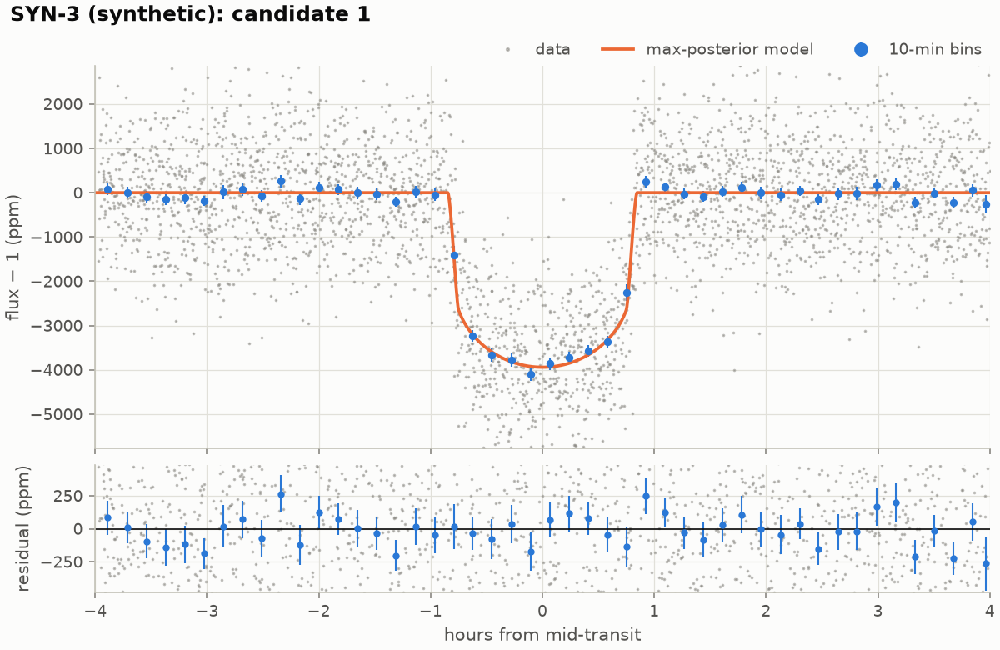
  <br><sub>A 2.4 Earth-radius planet recovered from a simulated three-planet M-dwarf system: its 14 transits stacked on top of each other, with the best-fitting physical model in orange.</sub>
</p>

---

## At a glance

| | |
|---|---|
| **What it does** | Download → clean → detrend → iterative BLS search → MCMC fit → eclipsing-binary vetting → report |
| **Confirmed TESS planets recovered** | 10 of 10 around five stars, from a 0.94-day hot Jupiter to two planets smaller than Earth; fitted radius ratios within 6 % of the published values for eight of the ten |
| **Impostors caught in real data** | 4 of 4 signals that match no known planet or TOI rejected by the vetting, including an eclipsing binary in L 98-59's light curve |
| **Verdicts on unresolved TOIs** | of 5 TESS planet candidates, 2 pass every test, 2 pass with a caveat (one because two tests could not run) and 1 is labeled a likely false positive |
| **Vetting against the follow-up team's verdicts** | of 30 resolved TOIs, no confirmed planet rejected (13 found) and 8 of 12 known false positives caught, 2 of them only by the centroid test on the target pixels; no threshold needed to move |
| **False alarms on real stars** | 2 of 100 stars without known planets or TOIs gave a detection, both just above the thresholds |
| **Completeness on a real light curve** | 80.6 % of 2,048 planets injected into two sectors of HD 21749 recovered (a smaller, quieter star than the synthetic one below) |
| **Planets recovered in the end-to-end benchmark** | 6 of 6 injected planets across 4 simulated systems, including all 3 planets of a compact M-dwarf system |
| **Period accuracy** | within 0.002 % of the true period for every benchmark planet |
| **Radius accuracy** | within 8 % of the true radius for every benchmark planet (4 of 6 within 2.5 %) |
| **Impostor rejection** | the eclipsing-binary control was flagged as a false positive (odd and even eclipses differ at 229σ) |
| **Sensitivity** | 71.7 % of 2,048 injected planets (0.7–8 R⊕, 0.5–20 d) recovered; 100 % of those larger than 3.2 R⊕ |
| **False alarms on pure noise** | 1 of 450 single-sector noise-only light curves |
| **Speed** | 0.6 s per search on one sector of data; about 2.4 minutes on three years (4 CPU cores) |
| **Tests** | offline pytest suite + ruff, run by GitHub Actions on Python 3.11 and 3.12 |

These headline numbers come from the files in [`results/`](results/) (sources:
[validation](results/validation/validation.md),
[TOI candidates](results/candidates/candidates.md),
[resolved TOIs](results/toi_calibration/calibration.md),
[real false alarms](results/false_alarms_real/false_alarms_real.md),
[real completeness](results/injection_tic279741379/completeness.md),
[benchmark](results/synthetic_benchmark/benchmark.md),
[completeness](results/injection_synthetic/completeness.md),
[false alarms](results/calibration/false_alarms.md),
[search cost](results/performance/search_scaling.md)). The detailed tables further down are
inserted by `scripts/update_docs.py` and never typed by hand. The first six rows after
"What it does" come from **real TESS data**; the rest come from simulated TESS-like light
curves, where the true answer is known. [What the real data showed](#what-the-real-data-showed) summarizes the real-data runs,
including the planets the pipeline got wrong.

## Contents

1. [The science in two minutes](#the-science-in-two-minutes)
2. [How the pipeline works](#how-the-pipeline-works)
3. [Results](#results)
4. [Installation and usage](#installation-and-usage)
5. [Roadmap](#roadmap)
6. [Could this find a new exoplanet?](#could-this-find-a-new-exoplanet)
7. [Limitations](#limitations)
8. [Tests, CI, layout](#tests-and-ci)

---

## The science in two minutes

**TESS** (the Transiting Exoplanet Survey Satellite) has been photographing nearly the whole
sky since 2018, one 24° × 96° strip ("sector") at a time, for about 27 days per sector. For
hundreds of thousands of pre-selected bright stars it records a brightness measurement every
2 minutes. Stitched together, those measurements form a **light curve**: brightness versus
time.

If a planet's orbit happens to be lined up with our line of sight, the planet crosses in front
of its star once per orbit and blocks a tiny fraction of its light. That is a **transit**:

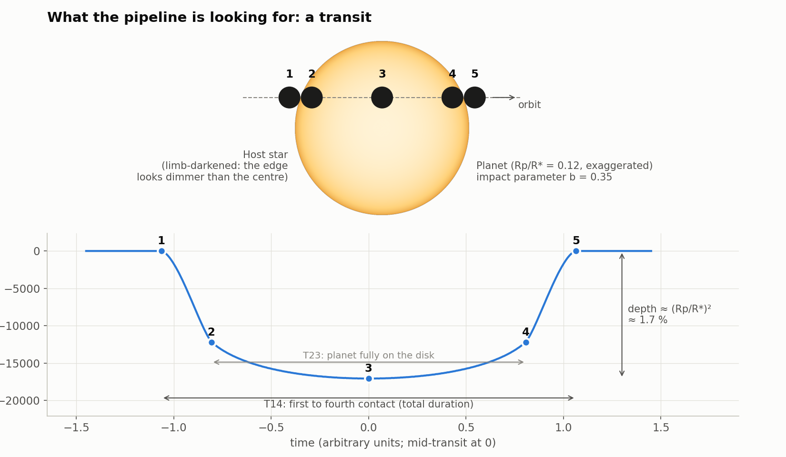

The shape of that dip encodes almost everything we can learn from photometry alone:

| feature of the dip | what it tells us |
|---|---|
| **depth** ≈ (Rp/R*)² | planet size relative to its star, and so its radius once the star's radius is known |
| **period** (time between dips) | orbital period, and with the star's mass, the orbital distance (Kepler's third law) |
| **duration** T14 | how fast the planet crosses, which constrains a/R* and the star's density |
| **ingress/egress shape** (T14 vs T23) | impact parameter: central or grazing crossing |
| **curvature of the bottom** | limb darkening of the star |

The catch is scale. Earth passing in front of the Sun dims it by **84 parts per million**
(0.0084 %). Jupiter dims it by about 1 %. Stars also flicker from spots, rotation and
granulation, often by thousands of ppm. Transit depth goes as 1/R*², so the same planet
makes a much deeper dip around a small star, which is why small red dwarfs are the best place
to look for small planets:

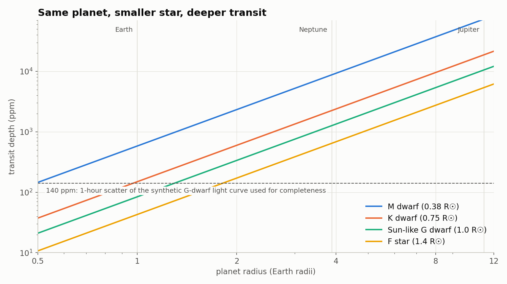

A single transit of an Earth around a Sun-like star is buried in the noise. The pipeline finds
it by folding: if you guess the right period and stack every transit on top of each other, the
noise averages down as √N while the dip stays put. Searching all possible periods, phases and
durations for the best stack is the job of the Box Least Squares algorithm.

Finding a dip is the easy part. Most periodic dips are not planets. **Eclipsing binaries**
(two stars orbiting each other), background binaries blended into the same pixels, starspots
and instrument glitches all make convincing dips. A good pipeline spends as much effort
rejecting signals as finding them.

As of June 2026 the TESS team counts **8,035 TESS Objects of Interest (TOIs), 897 confirmed
planets and 2,098 known false positives**
([TESS planet count](https://tess.mit.edu/tess-planet-count/)). The thousands of TOIs in
between are unresolved, and that gap is where independent pipelines like this one are useful.

---

## How the pipeline works

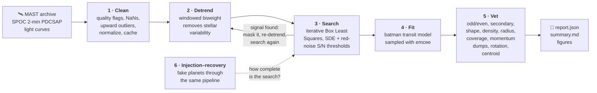
```mermaid
flowchart LR
    A["🛰️ MAST archive<br/>SPOC 2-min PDCSAP<br/>light curves"] --> B["<b>1 · Clean</b><br/>quality flags, NaNs,<br/>upward outliers,<br/>normalize, cache"]
    B --> C["<b>2 · Detrend</b><br/>windowed biweight<br/>removes stellar<br/>variability"]
    C --> D["<b>3 · Search</b><br/>iterative Box Least<br/>Squares, SDE + red-<br/>noise S/N thresholds"]
    D -->|"signal found:<br/>mask it, re-detrend,<br/>search again"| C
    D --> E["<b>4 · Fit</b><br/>batman transit model<br/>sampled with emcee"]
    E --> F["<b>5 · Vet</b><br/>odd/even, secondary,<br/>shape, density, radius,<br/>coverage, momentum<br/>dumps, rotation,<br/>centroid"]
    F --> G["📄 report.json<br/>summary.md<br/>figures"]
    H["<b>6 · Injection–recovery</b><br/>fake planets through<br/>the same pipeline"] -.->|"how complete<br/>is the search?"| D
```

Each stage is its own module in [`src/transit_hunter/`](src/transit_hunter/) and can be used on
its own. Full technical detail, with references, is in [docs/methods.md](docs/methods.md).
The figures below are real pipeline output, from the synthetic benchmark system **SYN-3** (a
compact three-planet system around an M dwarf) and **SYN-5** (an eclipsing binary).

### 1 · Download and clean (`data.py`)

The pipeline downloads every SPOC 2-minute light curve for the target with `lightkurve`,
using the **PDCSAP** flux, which NASA has already corrected for spacecraft systematics and for
light from neighboring stars. It then:

- drops cadences flagged for momentum dumps, safe modes, scattered light and similar events;
- normalizes each sector by its median;
- clips outliers **above** the local trend only (4σ, iterated). A symmetric clip would delete
  the bottom of a deep transit; the test suite checks this;
- caches the cleaned, stitched light curve with its provenance, so later runs work offline.

### 2 · Detrend (`detrend.py`)

Stars vary, sometimes by 100× the depth of the transit you are looking for. A **time-windowed
Tukey biweight filter** (`wotan`, 0.75-day window) follows the slow variability but treats the
few in-transit points in each window as outliers, so the transit survives. The light curve is
split at data gaps and each segment is detrended separately.

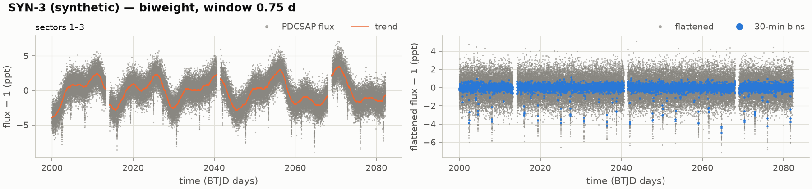

*Left: the simulated star varies by about ±5 ppt from starspots (orange = fitted trend). Right:
after flattening, the transits of three planets are visible as downward spikes.*

After each detection, the raw data are **detrended again with the known transits masked**,
because an unmasked filter dips slightly under every transit and absorbs part of its depth.

### 3 · Search (`search.py`)

**Box Least Squares** (Kovács et al. 2002) tries every combination of period, phase and duration
and asks: how much better does a box-shaped dip fit than a flat line? Details that matter:

- **Physical period × duration grid.** Periods run from 0.5 days to half the baseline, spaced
  so that no transit smears by more than a third of its duration. At each period only durations
  that are physically possible for the star's density are tried, which keeps multi-year searches
  tractable.
- **Two detection statistics.** The **SDE** (how far the peak stands above the rest of the
  periodogram) must be ≥ 7, and a **red-noise-aware S/N** must be ≥ 7 or a trial-corrected
  1 % false-alarm level, whichever is higher. Longer searches try more combinations, so their
  bar rises. "The rest of the periodogram" means trial periods whose best box holds at least
  two transits with data: in light curves spread over years, boxes on a single dip would
  otherwise set the scale.
- **Dips at the edges of the data.** Strong single dips that the data do not cover on both
  sides and that lie next to a gap of more than half a day, most often instrumental events
  right after or before the gap, are masked before each pass. Left in, they lift the whole
  periodogram and pair up into long-period "planets". A dip left uncovered by a few missing
  cadences inside a stretch of data is kept: in the validation, most of those were transits
  of the known planets.
- **Alias handling.** The strongest peak is checked against P/3, P/2, 2P and 3P, and the
  period with the highest likelihood wins.
- **Starspot rejection.** A spot makes a dip *and* a bump; a planet only makes a dip. The
  folded light curve is scanned for a brightening comparable to the dip, and such peaks are
  skipped (a variant of the Kepler Robovetter's model-shift test).
- **Iterative multi-planet search.** After each detection the transits are masked and the
  search repeats, up to five times. New signals are checked against earlier ones so that
  harmonics and secondary eclipses aren't counted as extra planets, while near-resonant real
  planets (like TOI-270 c and d, near 2:1) are kept apart.

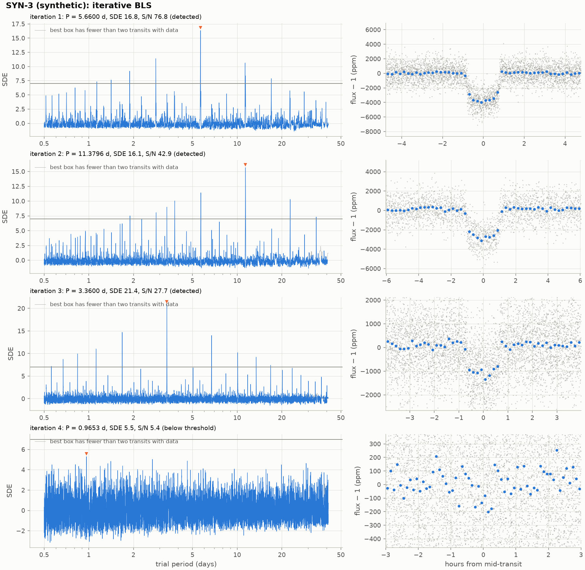

*Iterative search on SYN-3: the 5.66 d, 11.38 d and 3.36 d planets are found one after
another. The fourth iteration finds nothing above the gray threshold line, so the search stops.*

### 4 · Fit (`fit.py`)

Each detection is fitted with a **batman** transit model (Kreidberg 2015), with quadratic limb
darkening, sampled by the **emcee** MCMC ensemble sampler (Foreman-Mackey et al. 2013). The
free parameters are mid-transit time, period, Rp/R*, a/R*, impact parameter, two
limb-darkening coefficients (Kipping 2013 parameterization), baseline and a jitter term. The
sampler runs until the chain is 50 autocorrelation times long or hits its step limit. From the
posterior samples it derives the planet radius (using the TIC stellar radius, with its
uncertainty propagated), inclination, T14, semi-major axis, equilibrium temperature and the
**transit-implied stellar density**.

The stellar density is deliberately *not* given a prior, because comparing it with the catalog
value is one of the strongest vetting tests.

### 5 · Vet (`vet.py`)

First, every transit is measured on its own, and a rare one whose depth is far from the rest
(one sitting on an instrumental ramp, say) is left out of the fit and the tests. Then every
candidate faces nine tests aimed at eclipsing binaries and other impostors, eight on the
light curve and one on the target pixels:

| test | the impostor it catches | fails when |
|---|---|---|
| **odd/even depth** | a binary with two similar eclipses, detected at half its true period | odd and even depths, each transit measured against its own surroundings, differ by > 3σ (uncertainties at least the transit-to-transit scatter) |
| **secondary eclipse** | a binary's second, fainter eclipse | a ≥ 3σ dip at phase 0.5 (or ≥ 5σ at any phase), still significant without its strongest orbit, deeper than twice the brightest physically possible planetary occultation |
| **V vs U shape** | grazing binaries | warning when ingress + egress ≥ 80 % of the duration |
| **stellar density** | a signal on a different, larger star (a blend or giant) | transit-implied density differs from the catalog by > 3σ *and* more than 5× |
| **radius** | stellar companions | companion > 2.5 R_Jup |
| **data coverage** | "transits" made of instrumental events at the edges of data gaps | no transit has data inside it and on both sides (warning if only one has) |
| **momentum dumps** | dips made when TESS fires its thrusters, which can shift light between neighboring stars' apertures | the transits at momentum dumps are ≥ 3σ deeper and the others show no dip, or every transit falls at a dump against odds below 1 % (warning if the transits at dumps are only deeper) |
| **rotation period** | starspot residuals | warning when the period sits at the star's rotation period, half of it or twice it |
| **centroid** | an eclipsing binary on a neighboring star, blended into the aperture | in the target-pixel files, a model of the TESS pixel response fitted to the in-transit difference images puts the dip ≥ 3σ from the target (2.5″ systematic floor; the report names the cataloged star at the dip) |

Any failure gives the verdict **likely false positive**; warnings, or a test that could not
run (such as the density test for a star without a catalog radius), give **planet candidate
(with caveats)**; a clean sweep of tests that all ran gives **planet candidate (passes all
tests)**.

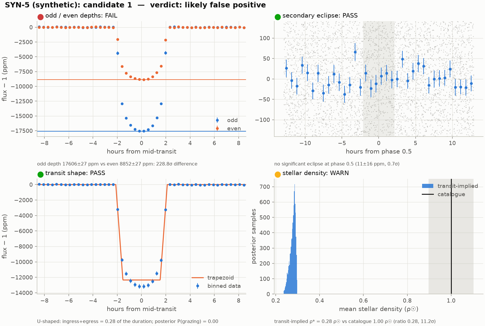

*The eclipsing-binary control SYN-5. BLS locked on at half the true period, so the "transits"
alternate between two different stars' eclipses. The odd/even test catches it at 229σ, and the
density test adds a warning.*

On real TESS data the same tests caught an eclipsing binary hiding in the light curve of the
planet host L 98-59, and recognized WASP-18 b's own occultation as planetary (examples on the
[vetting page](https://comdex4.github.io/tess-transit-hunter/pipeline/vet.html)).

### 6 · Injection–recovery (`inject.py`)

To know what the search *misses*, thousands of fake planets are multiplied into a light curve
**before** detrending and pushed through the same detrend-and-search steps. The fraction
recovered in each period × radius cell is the pipeline's **completeness**, the number any
occurrence-rate or "no planet here" statement depends on. Injections run in parallel and the run
can be resumed.

---

## Results

### Project status

<!-- BEGIN: status -->

| analysis | needs | status |
|---|---|---|
| False-alarm calibration (synthetic noise) | offline (synthetic data) | done |
| End-to-end benchmark on synthetic systems | offline (synthetic data) | done |
| Injection–recovery on a synthetic light curve | offline (synthetic data) | done |
| Validation on confirmed TESS planets | MAST + Exoplanet Archive | done |
| Vetting of TOI planet candidates | MAST + Exoplanet Archive | done |
| Injection–recovery on a real TESS light curve | MAST + Exoplanet Archive | done |
| Vetting checked against resolved TOIs | MAST + Exoplanet Archive | done |
| False alarms on real stars without planets | MAST + Exoplanet Archive | done |

The analyses of real TESS data used SPOC 2-minute light curves from MAST (every available sector for the validation and the candidate verdicts; the sectors named with each of the other analyses) and reference values from the NASA Exoplanet Archive at the time they were run. The result tables, figures, and summary numbers on these pages are copied from `results/` by `scripts/update_docs.py`, not typed by hand.

<!-- END: status -->

### What the real data showed

- **All 10 confirmed planets recovered** around five stars (WASP-18, pi Men, TOI-270,
  L 98-59, HD 21749), from a 0.94-day hot Jupiter to two planets smaller than Earth,
  L 98-59 b (0.86 R⊕) and HD 21749 c (0.98 R⊕ fitted, 0.89 R⊕ published). For eight of the
  ten, the fitted radius ratio is within 6 % of the published value (median 3.4 %); the
  other two are TOI-270 c and d.
- **The first run's failures are fixed.** HD 21749 c had been missed although it is in the
  data at S/N 16.6: a few deep instrumental dips at the edges of data segments swamped the
  periodogram. They are now masked, and c is found at S/N 20. A single transit on an
  instrumental ramp had made HD 21749 b fail the odd/even test; such transits are now left
  out before the fit, and b passes. TOI-270 d still fails the stellar-density test, and c
  gets a density warning. Both planets' transit times shift between observing seasons, and
  both fits prefer longer, more grazing transits than the published ones; a fold on one
  period that smears the transits is the likely cause, not yet established.
- **Real impostors are caught.** Four detections match no known planet or TOI, and the
  vetting rejects all four. They include a 1.049-day eclipsing binary in L 98-59's light
  curve, with a 37 ppm eclipse at phase 0.5 and a transit-implied density far below the
  star's (0.1 against 9.4 ρ☉); the centroid test places it on a star of magnitude 16.2, 46″
  from L 98-59. Catching it on the final code took a fix to the density
  test, whose verdict a poorly converged fit had diluted. WASP-18 b's own occultation
  (355 ± 11 ppm) is kept as planetary.
- **Blends caught in the pixels.** Among the TOIs the follow-up team has resolved, the
  centroid test finds five of the 12 detected false positives on a fainter neighboring star
  11–37″ from the target; for two of them, TOI-600.01 and TOI-619.01, it is the only test
  that fails. It puts every confirmed planet's dip among those TOIs on its star (largest
  offset 2.1σ, against a limit of 3σ), and nine of the ten around the five validation stars;
  the tenth, HD 21749 c, is too shallow to see in the pixels and gets a caveat.
- **Five unresolved TOIs, five verdicts.** TOI-1717.01 and TOI-1019.01 pass every test;
  TOI-4543.01 gets a caveat because two tests could not run (the TIC has no radius for its
  star); TOI-4597.01 gets a density warning; and TOI-1059.01 fails the radius test on a
  grazing fit. TOI-1019.01 had failed the odd/even test on a 1.1 % depth difference at
  S/N 689; measured against the flux around each transit, its odd and even depths agree.
  The centroid test puts all five dips on their stars, though for TOI-1717.01 it cannot
  exclude a star of magnitude 13.4 only 3″ away.
  The [candidates page](https://comdex4.github.io/tess-transit-hunter/candidates.html#what-the-verdicts-rest-on)
  says what each verdict rests on.
- **Completeness on a real light curve.** 80.6 % of 2,048 planets injected into two sectors
  of HD 21749 are recovered, against 71.7 % for the synthetic G dwarf. That is not because
  real data are cleaner: the star is smaller and quieter, so the same planet gives a higher
  S/N. The real data add gaps (8 injections had fewer than two transits in the data) and
  aliases (2 injections found only at an alias period), which the simulation has none of.
  The changes made for HD 21749 c (masking instrumental dips, and measuring the SDE only
  against trial periods that can hold two transits) let the search find 18 small planets it
  had missed, and cost four: one whose transit lay right at the edge of a data segment, and
  three whose S/N an instrumental dip had inflated. The first version of the dip mask, which
  also masked transits cut by short gaps, cost three more.

Details, with every number traced to `results/`, are on the
[validation](https://comdex4.github.io/tess-transit-hunter/validation.html#what-the-real-data-showed),
[candidates](https://comdex4.github.io/tess-transit-hunter/candidates.html#what-the-verdicts-rest-on)
and [completeness](https://comdex4.github.io/tess-transit-hunter/completeness.html#real-against-synthetic)
pages.

### End-to-end benchmark on synthetic systems (truth known)

Simulated TESS-like light curves go through the full pipeline (detrend, iterative BLS,
MCMC, vetting). They cover a hot Jupiter, a small planet around a bright star observed for
six sectors, a three-planet M-dwarf system, and a long-period planet, plus an eclipsing
binary as a negative control. These are **simulations, not TESS data**; the "published"
columns hold the injected (true) values.

<!-- BEGIN: benchmark -->

| planet | P published (d) | P recovered (d) | ΔP | depth published (ppm) | depth recovered (ppm) | Δdepth | Rp published (R⊕) | Rp recovered (R⊕) | ΔRp |
|---|---|---|---|---|---|---|---|---|---|
| SYN-1 b | 0.940000 | 0.940000 ± 8.8e-07 | -0.0000% | 9091 | 9074 ± 36 | -0.2% | 13.00 | 12.98 ± 0.39 | -0.1% |
| SYN-2 b | 6.270000 | 6.270082 ± 5e-05 | +0.0013% | 278 | 268 ± 23 | -3.7% | 2.00 | 1.98 ± 0.1 | -1.2% |
| SYN-3 b | 3.360000 | 3.359982 ± 6.5e-05 | -0.0005% | 984 | 1148 ± 85 | +16.7% | 1.30 | 1.40 ± 0.067 | +8.0% |
| SYN-3 c | 5.660000 | 5.660025 ± 4.9e-05 | +0.0004% | 3353 | 3313 ± 1.1e+02 | -1.2% | 2.40 | 2.39 ± 0.082 | -0.4% |
| SYN-3 d | 11.380000 | 11.379804 ± 0.00022 | -0.0017% | 2567 | 2771 ± 2.7e+02 | +8.0% | 2.10 | 2.19 ± 0.12 | +4.1% |
| SYN-4 b | 35.600000 | 35.599620 ± 0.00021 | -0.0011% | 1345 | 1409 ± 62 | +4.8% | 2.80 | 2.87 ± 0.11 | +2.4% |

Depth is the geometric depth (Rp/R*)² unless noted; Δ = 100 × (recovered − published) / published.


| system | description | sectors | detections | vetting verdicts |
|---|---|---|---|---|
| SYN-1 | hot Jupiter on a sub-day orbit around an F star | 2 | 1 | planet candidate (passes all tests) |
| SYN-2 | small planet around a bright, quiet G dwarf observed for six sectors | 6 | 1 | planet candidate (passes all tests) |
| SYN-3 | compact three-planet system around an M dwarf | 3 | 3 | planet candidate (passes all tests); planet candidate (passes all tests); planet candidate (passes all tests) |
| SYN-4 | long-period sub-Neptune around a K dwarf (six contiguous sectors) | 6 | 1 | planet candidate (passes all tests) |
| SYN-5 | eclipsing binary found at half its period (negative control) | 2 | 1 | likely false positive |

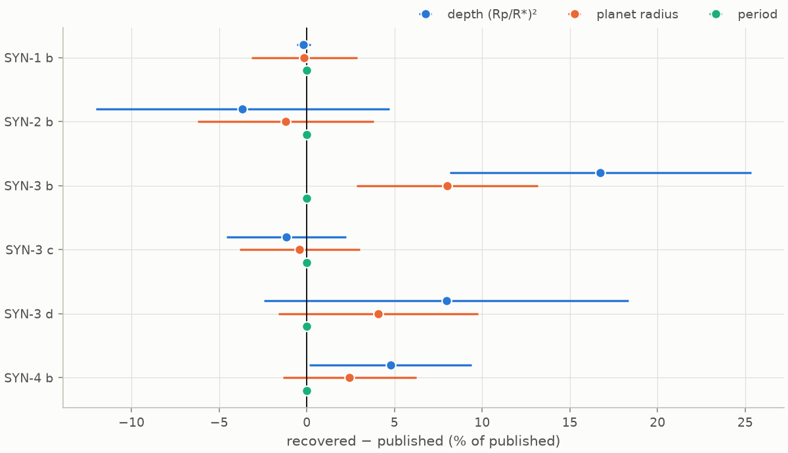

<!-- END: benchmark -->

### Completeness (injection–recovery)

<!-- BEGIN: completeness_summary -->

2048 injections (0.7–8 R⊕, 0.5–20 d) into a synthetic TESS-like light curve of a G dwarf: 38020 points over 54.8 days; robust scatter of the flattened light curve 0.5h: 185 ppm, 1h: 140 ppm, 2h: 99 ppm. Overall recovery: 71.7 %; 0 injections were found only at an alias period.

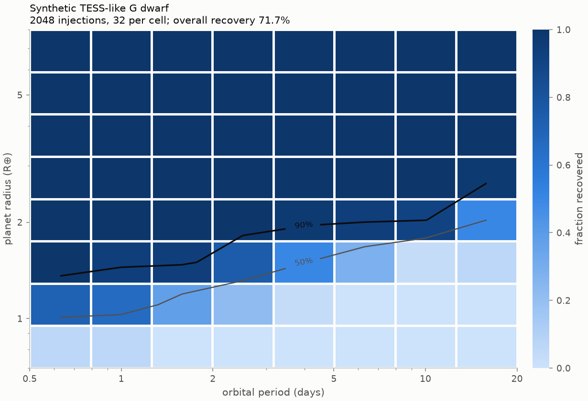

<!-- END: completeness_summary -->

**How to read the map:** everything larger than about 2.4 R⊕ is found almost every time
out to 20 days. Earth-sized planets (0.95–1.3 R⊕) are recovered 72 % of the time on
sub-day orbits but essentially never beyond 5 days on this star with two sectors of data. That
boundary is set by how many transits are stacked and how noisy the star is, and it moves
outward with more sectors, a quieter star, or a smaller star. The per-cell table and the
real-light-curve version are on the
[completeness page](https://comdex4.github.io/tess-transit-hunter/completeness.html).

### False-alarm calibration

<!-- BEGIN: calibration -->

Noise-only synthetic light curves (no transits), 150 per case, searched without a stellar-density prior (the widest duration grid). A false alarm is a strongest peak with SDE ≥ 7, S/N at or above the applied threshold (the larger of 7 and the trial-corrected 1 % level), and at least two transits. In brackets: false alarms that the vetting would flag as lying at the star's rotation period, half of it, or twice it (Lomb–Scargle of the un-detrended light curve). The last column counts light curves in which at least one stronger peak was skipped as stellar variability before the strongest peak was chosen. In every case, at least 98.8 % of the trial periods had a best box with two transits on data, the trials that standardize the SDE; dips at the edges of the data were masked in 34 of the 600 light curves.

| noise regime | sectors | median 1-h CDPP (ppm) | SDE median / 99th pct / max | S/N median / 99th pct / max | S/N threshold applied | false alarms (at P_rot) | peaks skipped as variability |
|---|---|---|---|---|---|---|---|
| quiet | 1 | 59 | 4.9 / 6.6 / 8.1 | 5.3 / 7.0 / 7.3 | 7.00 | 1/150 (0) | 21/150 |
| moderate | 1 | 173 | 4.3 / 6.3 / 6.7 | 4.9 / 8.7 / 9.3 | 7.00 | 0/150 (0) | 22/150 |
| active | 1 | 873 | 2.8 / 5.3 / 5.5 | 4.8 / 19.1 / 21.4 | 7.00 | 0/150 (0) | 93/150 |
| moderate | 3 | 170 | 5.0 / 8.2 / 8.6 | 6.1 / 11.5 / 13.8 | 7.00 | 11/150 (10) | 97/150 |

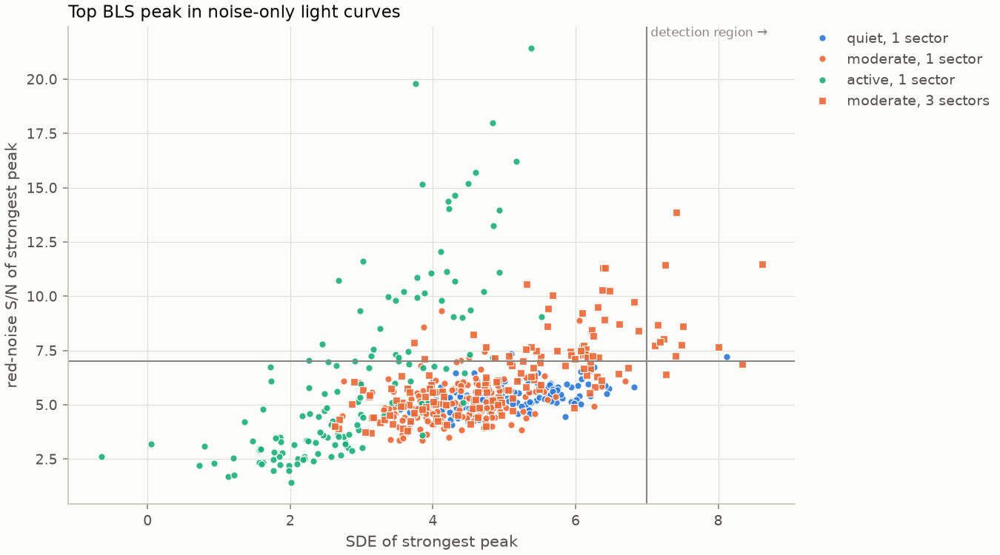

<!-- END: calibration -->

### False alarms on real stars

The same search on real stars around which no planet is known and no TOI has been raised
(`scripts/measure_real_false_alarms.py`): any detection is a false alarm of the planet
search, or a real signal that is not a planet, which the vetting has to catch.

<!-- BEGIN: false_alarms_real -->

Selection: stars with SPOC 2-minute light curves in sectors 1 and 2; no TOI of any disposition and no confirmed planet (NASA Exoplanet Archive); TIC luminosity class DWARF; Tmag <= 11; 100 drawn at random (seed 1) from the stars sorted by TIC ID.

* Stars searched: 100 (median 1-h scatter 196 ppm)
* Stars with at least one detection: 2 (2.0 %)
* Detections: 3; stars with a detection the vetting leaves as a planet candidate: 2
* Strongest peak of the first search pass: SDE median 5.3, 99th percentile 7.8, maximum 7.9; S/N median 5.7, 99th percentile 8.5, maximum 8.8

| TIC | P (d) | depth (ppm) | S/N | SDE | transits | verdict | failed tests |
|---|---|---|---|---|---|---|---|
| 308454245 | 0.8318 | 50 | 8.5 | 7.9 | 62 | planet candidate (with caveats) | – |
| 308454245 | 0.8309 | 47 | 7.9 | 9.6 | 62 | occultation of signal 1 (phase 0.54), consistent with a planet | – |
| 281598203 | 1.2720 | 90 | 7.7 | 7.8 | 42 | planet candidate (with caveats) | – |

<!-- END: false_alarms_real -->

Two of the hundred stars gave a detection, both just above the thresholds, and the vetting
kept both as candidates with caveats: a hot, pulsating star (two equal dips per cycle, the
second taken for an occultation), whose 50 ppm dip is too shallow for the centroid test to see
in the pixels, and a 7-hour "transit" every 1.27 days that would need a planet skimming its
star's surface, which the density test would have caught had the TIC listed the star's
density. A signal just above the thresholds on a variable star deserves suspicion even when
it passes the vetting.

### Search cost

<!-- BEGIN: performance -->

One BLS iteration on noise-only synthetic light curves, 4 worker processes (x86_64, 4 CPUs).

| data | ρ* known | points | trial periods | effective trials | S/N threshold (trial-corrected 1 %) | time per iteration (s) | of which edge dips and eligible trials (s) | top noise peak S/N / SDE |
|---|---|---|---|---|---|---|---|---|
| 1 sector (27 d) | yes | 19010 | 12041 | 2.8e+05 | 7.00 (5.86) | 0.6 | 0.03 | 5.7 / 3.8 |
| 3 sectors (82 d) | yes | 57028 | 42991 | 1.5e+06 | 7.00 (6.14) | 2.7 | 0.07 | 5.9 / 4.9 |
| 13 sectors (356 d) | yes | 247108 | 214269 | 1.3e+07 | 7.00 (6.48) | 28 | 0.33 | 5.6 / 6.9 |
| 26 sectors over 3 years (1086 d) | yes | 494212 | 694018 | 7.1e+07 | 7.00 (6.74) | 142 | 1.00 | 5.9 / 6.1 |
| 26 sectors over 3 years (1086 d) | no | 494212 | 1015247 | 2.2e+08 | 7.00 (6.90) | 607 | 1.10 | 5.9 / 7.9 |

Peaks skipped as stellar variability before the top peak was chosen:

* 1 sector (ρ* known): P = 0.59 d, SDE 4.5: folded light curve also brightens (4.4 sigma, against 4.9 sigma for the dip): stellar variability
* 26 sectors over 3 years (ρ* known): P = 12.03 d, SDE 7.9: folded light curve also brightens (7.0 sigma, against 8.6 sigma for the dip): stellar variability
* 26 sectors over 3 years (ρ* known): P = 0.55 d, SDE 7.3: folded light curve also brightens (4.0 sigma, against 6.1 sigma for the dip): stellar variability
* 26 sectors over 3 years (ρ* unknown): P = 6.01 d, SDE 9.4: folded light curve also brightens (6.3 sigma, against 8.4 sigma for the dip): stellar variability
* 26 sectors over 3 years (ρ* unknown): P = 12.03 d, SDE 8.2: folded light curve also brightens (7.0 sigma, against 8.6 sigma for the dip): stellar variability

<!-- END: performance -->

### Confirmed TESS planets

<!-- BEGIN: validation -->

| planet | P published (d) | P recovered (d) | ΔP | depth published (ppm) | depth recovered (ppm) | Δdepth | Rp published (R⊕) | Rp recovered (R⊕) | ΔRp |
|---|---|---|---|---|---|---|---|---|---|
| WASP-18 b | 0.941452 | 0.941452 ± 9.9e-09 | +0.0000% | 10363 | 9816 ± 26 | -5.3% | 13.90 ± 0.89 | 14.54 ± 0.75 | +4.6% |
| pi Men c | 6.267840 | 6.267822 ± 1e-06 | -0.0003% | 251 | 274 ± 7.9 | +9.3% | 2.02 ± 0.046 | 2.08 ± 0.085 | +3.2% |
| TOI-270 b | 3.359920 | 3.360163 ± 9.2e-07 | +0.0072% | 942 | 1015 ± 61 | +7.7% | 1.28 ± 0.045 | 1.30 ± 0.056 | +1.6% |
| TOI-270 c | 5.660510 | 5.660478 ± 1.2e-06 | -0.0006% | 3136 | 3881 ± 5.3e+02 | +23.8% | 2.33 ± 0.01 | 2.54 ± 0.19 | +8.8% |
| TOI-270 d | 11.381940 | 11.379700 ± 4.5e-06 | -0.0197% | 2411 | 3483 ± 2e+02 | +44.5% | 2.00 ± 0.05 | 2.41 ± 0.1 | +20.6% |
| L 98-59 b | 2.253114 | 2.253114 ± 3.4e-07 | +0.0000% | 666 | 627 ± 26 | -5.8% | 0.84 ± 0.019 | 0.86 ± 0.032 | +2.7% |
| L 98-59 c | 3.690676 | 3.690675 ± 4e-07 | -0.0000% | 1568 | 1593 ± 1.2e+02 | +1.6% | 1.33 ± 0.029 | 1.37 ± 0.064 | +2.9% |
| L 98-59 d | 7.450729 | 7.450729 ± 1.4e-06 | +0.0000% | 2116 | 2008 ± 2.5e+02 | -5.1% | 1.63 ± 0.041 | 1.53 ± 0.11 | -5.7% |
| HD 21749 c | 7.789930 | 7.789772 ± 1.2e-05 | -0.0020% | 143 | 158 ± 39 | +10.6% | 0.89 ± 0.061 | 0.98 ± 0.15 | +9.7% |
| GJ 143 b | 35.612530 | 35.613439 ± 1.6e-05 | +0.0026% | 1225 | 1281 ± 94 | +4.6% | 2.61 ± 0.17 | 2.76 ± 0.27 | +5.8% |

Depth is the geometric depth (Rp/R*)² unless noted; Δ = 100 × (recovered − published) / published.

| host | sectors | signal | P (d) | S/N | known as | vetting verdict | failed tests / warnings |
|---|---|---|---|---|---|---|---|
| WASP-18 | 10 | 1 | 0.94145 | 787.8 | WASP-18 b | planet candidate (passes all tests) | – |
| WASP-18 | 10 | 2 | 0.94145 | 38.9 | – | occultation of signal 1 (phase 0.50), consistent with a planet | – |
| pi Men | 24 | 1 | 6.26781 | 106.5 | pi Men c | planet candidate (passes all tests) | – |
| TOI-270 | 7 | 1 | 5.66048 | 89.4 | TOI-270 c | planet candidate (with caveats) | warnings: density, rotation |
| TOI-270 | 7 | 2 | 11.37971 | 55.3 | TOI-270 d | likely false positive | failed: density; warnings: rotation |
| TOI-270 | 7 | 3 | 3.36016 | 31.3 | TOI-270 b | planet candidate (passes all tests) | – |
| TOI-270 | 7 | 4 | 46.66587 | 9.3 | no confirmed planet or TOI | likely false positive | failed: coverage |
| TOI-270 | 7 | 5 | 88.83541 | 8.2 | no confirmed planet or TOI | likely false positive | failed: odd_even, density; warnings: shape, coverage |
| L 98-59 | 27 | 1 | 3.69068 | 131.5 | L 98-59 c | planet candidate (passes all tests) | – |
| L 98-59 | 27 | 2 | 7.45073 | 64.8 | L 98-59 d | planet candidate (passes all tests) | – |
| L 98-59 | 27 | 3 | 2.25312 | 62.5 | L 98-59 b | planet candidate (passes all tests) | – |
| L 98-59 | 27 | 4 | 1.04918 | 36.8 | no confirmed planet or TOI | likely false positive | failed: density, centroid |
| L 98-59 | 27 | 5 | 0.52460 | 9.4 | – | occultation of signal 4 (phase 0.50), consistent with a planet | – |
| HD 21749 | 15 | 1 | 35.61342 | 65.8 | GJ 143 b | planet candidate (passes all tests) | – |
| HD 21749 | 15 | 2 | 7.78981 | 19.9 | HD 21749 c | planet candidate (with caveats) | – |
| HD 21749 | 15 | 3 | 145.68370 | 45.4 | no confirmed planet or TOI | likely false positive | failed: density, centroid; warnings: shape, coverage |

Known as: the confirmed planet (NASA Exoplanet Archive) or, failing that, the TOI and its TFOPWG disposition with the same period to within 1 %.

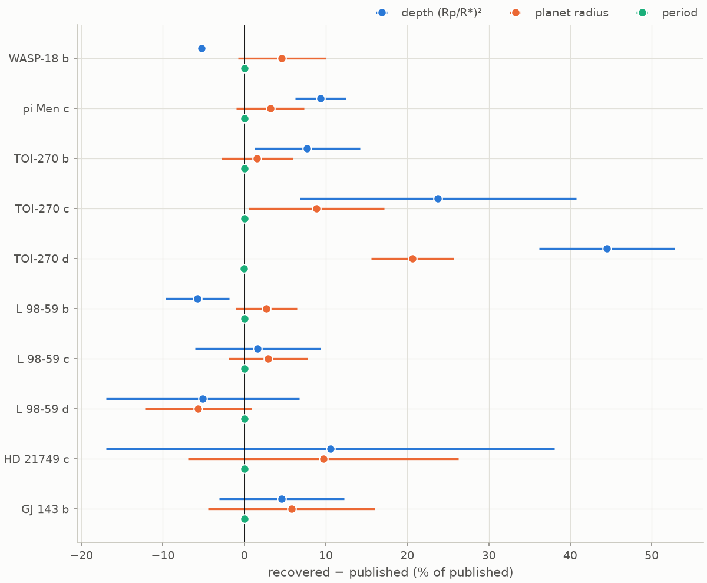

The search missed none of the confirmed planets (`scripts/check_missed_planets.py`).

<!-- END: validation -->

### TOI planet candidates

<!-- BEGIN: candidates -->

| TOI | TIC | catalog P (d) | recovered P (d) | Rp (R⊕) | verdict |
|---|---|---|---|---|---|
| TOI-1059.01 | 380783252 | 9.44965 | 9.44966 | 55.13 | likely false positive |
| TOI-4543.01 | 435336785 | 5.77403 | 5.77459 | – | planet candidate (with caveats) |
| TOI-4597.01 | 68573534 | 4.66638 | 4.66716 | 13.14 | planet candidate (with caveats) |
| TOI-1019.01 | 341420329 | 5.23410 | 5.23409 | 24.42 | planet candidate (passes all tests) |
| TOI-1717.01 | 149833117 | 4.05239 | 4.05239 | 14.07 | planet candidate (passes all tests) |

### TOI-1059.01

* [pass] odd_even: odd depth 24609±252 ppm vs even 24467±215 ppm: 0.4σ difference (uncertainties include the 712 ppm scatter between transits)
* [pass] secondary: no significant eclipse at phase 0.5 (89±86 ppm, 1.0σ); a 499 ppm dip at phase 0.60 (5.9σ) comes from a single orbit and is not counted
* [warn] shape: intermediate: ingress+egress = 0.79 of the duration; posterior P(grazing) = 1.00
* [warn] density: transit-implied ρ* = 2.46 ρ☉ vs catalog 1.05 ρ☉ (ratio 2.35, 3.3σ)
* [fail] radius: companion radius 4.94 R_Jup
* [pass] coverage: 19 of 19 transits with data are fully covered (inside and on both sides)
* [pass] rotation: period is not near the rotation period (10.24 d) or its multiples
* [pass] centroid: the dip is 3.1″ from the target (0.7σ, 4 sectors); stars within 9″ of it cannot be excluded, and no cataloged star there is bright enough to cause it

### TOI-4543.01

* [pass] odd_even: odd depth 4356±153 ppm vs even 4460±176 ppm: 0.4σ difference
* [pass] secondary: no significant eclipse at phase 0.5 (-52±80 ppm, -0.6σ)
* [pass] shape: intermediate: ingress+egress = 0.52 of the duration; posterior P(grazing) = 0.00
* [n/a] density: no fitted or catalog density
* [n/a] radius: no stellar radius
* [pass] coverage: 7 of 8 transits with data are fully covered (inside and on both sides)
* [n/a] rotation: no clear rotational modulation
* [pass] centroid: the dip is 1.2″ from the target (0.1σ, 2 sectors); stars within 9″ of it cannot be excluded, and no cataloged star there is bright enough to cause it
* not tested: density, radius, so the verdict rests on the other tests

### TOI-4597.01

* [pass] odd_even: odd depth 7207±350 ppm vs even 7401±391 ppm: 0.4σ difference
* [pass] secondary: no significant eclipse at phase 0.5 (2±192 ppm, 0.0σ)
* [pass] shape: U-shaped: ingress+egress = 0.19 of the duration; posterior P(grazing) = 0.00
* [warn] density: transit-implied ρ* = 1.52 ρ☉ vs catalog 0.47 ρ☉ (ratio 3.24, 3.8σ)
* [pass] radius: companion radius 1.17 R_Jup
* [pass] coverage: 9 of 9 transits with data are fully covered (inside and on both sides)
* [n/a] rotation: no clear rotational modulation
* [pass] centroid: the dip is 2.8″ from the target (0.6σ, 2 sectors); stars within 9″ of it cannot be excluded, and no cataloged star there is bright enough to cause it

### TOI-1019.01

* [pass] odd_even: odd depth 20783±57 ppm vs even 20846±59 ppm: 0.8σ difference
* [pass] secondary: no significant eclipse at phase 0.5 (21±31 ppm, 0.7σ)
* [pass] shape: U-shaped: ingress+egress = 0.45 of the duration; posterior P(grazing) = 0.00
* [pass] density: transit-implied ρ* = 0.45 ρ☉ vs catalog 0.47 ρ☉ (ratio 0.97, 0.2σ)
* [pass] radius: companion radius 2.18 R_Jup
* [pass] coverage: 39 of 40 transits with data are fully covered (inside and on both sides)
* [n/a] rotation: no clear rotational modulation
* [pass] centroid: the dip is 0.1″ from the target (0.0σ, 4 sectors); stars within 9″ of it cannot be excluded, and no cataloged star there is bright enough to cause it

### TOI-1717.01

* [pass] odd_even: odd depth 8541±542 ppm vs even 8723±626 ppm: 0.2σ difference (uncertainties include the 1877 ppm scatter between transits)
* [pass] secondary: no significant eclipse at phase 0.5 (-115±215 ppm, -0.5σ)
* [pass] shape: U-shaped: ingress+egress = 0.46 of the duration; posterior P(grazing) = 0.00
* [pass] density: transit-implied ρ* = 0.52 ρ☉ vs catalog 0.55 ρ☉ (ratio 0.95, 0.2σ)
* [pass] radius: companion radius 1.25 R_Jup
* [pass] coverage: 21 of 21 transits with data are fully covered (inside and on both sides)
* [pass] rotation: period is not near the rotation period (0.30 d) or its multiples
* [pass] centroid: the dip is 0.9″ from the target (0.1σ, 4 sectors); stars within 10″ of it cannot be excluded: TIC 743431875 (Tmag 13.4, 3″) could cause it

<!-- END: candidates -->

### Vetting checked against resolved TOIs

The full pipeline on TOIs whose nature the TESS follow-up team has settled: confirmed or
known planets (CP, KP) and false positives (FP), with the same cuts as the candidates above
(`scripts/calibrate_vetting_on_tois.py`).

<!-- BEGIN: toi_calibration -->

Selection: TFOPWG disposition CP or KP (planet) or FP (false positive); 1 d < P < 15 d; Tmag <= 11; depth >= 800 ppm; one TOI per star; SPOC 2-minute light curves under the TOI's own TIC ID; random order within each class (seed 1); first 15 of each class; the first observing season of each star (its first sector with 2-minute data and those numbered up to 3 after it).

| TFOPWG class | TOIs | planet candidate (passes all tests) | planet candidate (with caveats) | likely false positive | not recovered by the search |
|---|---|---|---|---|---|
| planet | 15 | 11 | 2 | 0 | 2 |
| false positive | 15 | 2 | 2 | 8 | 3 |

Outcome of each vetting test for the recovered TOIs (fail / warn / pass / n/a):

| test | planet | false positive |
|---|---|---|
| odd_even | 0 / 0 / 13 / 0 | 1 / 0 / 11 / 0 |
| secondary | 0 / 0 / 13 / 0 | 0 / 0 / 12 / 0 |
| shape | 0 / 0 / 13 / 0 | 0 / 7 / 5 / 0 |
| density | 0 / 1 / 12 / 0 | 5 / 1 / 3 / 3 |
| radius | 0 / 0 / 13 / 0 | 3 / 0 / 7 / 2 |
| coverage | 0 / 0 / 13 / 0 | 1 / 0 / 11 / 0 |
| rotation | 0 / 1 / 4 / 8 | 0 / 0 / 5 / 7 |
| centroid | 0 / 0 / 13 / 0 | 5 / 0 / 7 / 0 |

The statistic each test's thresholds apply to, for the recovered TOIs: median and range (number of TOIs).

| statistic | planet | false positive |
|---|---|---|
| odd/even difference (σ) | 0.46 (0.12 to 1.69; 13) | 0.69 (0.01 to 17.47; 12) |
| dip at phase 0.5 (σ) | 0.66 (-1.58 to 6.43; 13) | 0.25 (-1.79 to 1.24; 12) |
| ingress + egress / duration | 0.26 (0.08 to 0.65; 13) | 0.73 (0.10 to 0.90; 12) |
| posterior P(grazing) | 0.00 (0.00 to 0.02; 13) | 0.04 (0.00 to 0.97; 12) |
| transit-implied / catalog density | 1.08 (0.34 to 2.99; 13) | 1.63 (0.06 to 12.60; 9) |
| companion radius (R_J) | 1.26 (0.22 to 1.82; 13) | 1.44 (0.25 to 9.07; 10) |
| dip offset from the target (σ) | 0.26 (0.01 to 2.11; 13) | 1.97 (0.10 to 14.78; 12) |
| dip offset from the target (″) | 1.70 (0.31 to 8.75; 13) | 7.60 (1.03 to 37.50; 12) |

| TOI | TIC | TFOPWG | P (d) | depth (ppm) | sectors | found at | verdict | tests failed |
|---|---|---|---|---|---|---|---|---|
| TOI-834.01 | 404340025 | KP | 2.6756 | 14341 | 1 | 1 × P | planet candidate (passes all tests) | – |
| TOI-824.01 | 193641523 | CP | 1.3930 | 1576 | 2 | 1 × P | planet candidate (passes all tests) | – |
| TOI-125.01 | 52368076 | CP | 4.6517 | 978 | 2 | 1 × P | planet candidate (passes all tests) | – |
| TOI-1820.01 | 393831507 | CP | 4.8607 | 6140 | 1 | 1 × P | planet candidate (passes all tests) | – |
| TOI-2012.01 | 138294130 | KP | 3.0565 | 8800 | 1 | 1 × P | planet candidate (passes all tests) | – |
| TOI-2140.01 | 399860444 | KP | 2.4706 | 14311 | 1 | 1 × P | planet candidate (passes all tests) | – |
| TOI-264.01 | 122612091 | KP | 2.2167 | 4240 | 2 | 1 × P | planet candidate (with caveats) | – |
| TOI-1233.01 | 260647166 | CP | 14.1759 | 907 | 2 | – | not recovered by the search | – |
| TOI-1683.01 | 58542531 | CP | 3.0575 | 1118 | 1 | 1 × P | planet candidate (passes all tests) | – |
| TOI-4559.01 | 271169413 | CP | 3.9649 | 1161 | 1 | – | not recovered by the search | – |
| TOI-150.01 | 271893367 | CP | 5.8574 | 6490 | 4 | 1 × P | planet candidate (passes all tests) | – |
| TOI-1476.01 | 432549364 | KP | 1.2175 | 6969 | 1 | 1 × P | planet candidate (with caveats) | – |
| TOI-1151.01 | 69679391 | KP | 3.4741 | 15748 | 1 | 1 × P | planet candidate (passes all tests) | – |
| TOI-1410.01 | 199444169 | CP | 1.2169 | 1240 | 1 | 1 × P | planet candidate (passes all tests) | – |
| TOI-2154.01 | 428787891 | CP | 3.8241 | 10104 | 1 | 1 × P | planet candidate (passes all tests) | – |
| TOI-1369.01 | 155005217 | FP | 7.6047 | 1200 | 2 | 1 × P | likely false positive | odd_even |
| TOI-146.01 | 355636844 | FP | 6.3056 | 860 | 2 | – | not recovered by the search | – |
| TOI-1707.01 | 240148934 | FP | 2.0236 | 1710 | 3 | 1 × P | likely false positive | density, centroid |
| TOI-1401.01 | 259126549 | FP | 7.3845 | 25160 | 4 | 1 × P | planet candidate (with caveats) | – |
| TOI-1668.01 | 417705690 | FP | 2.3633 | 1121 | 1 | 1 × P | likely false positive | density, centroid |
| TOI-1108.01 | 295599256 | FP | 7.1440 | 11593 | 4 | 1 × P | likely false positive | density, radius |
| TOI-1309.01 | 287190564 | FP | 1.4986 | 2189 | 2 | 1 × P | likely false positive | density, radius, coverage, centroid |
| TOI-4420.01 | 362709886 | FP | 4.7259 | 6310 | 1 | 1 × P | planet candidate (with caveats) | – |
| TOI-981.01 | 127476180 | FP | 1.6038 | 1191 | 1 | – | not recovered by the search | – |
| TOI-619.01 | 267527924 | FP | 1.8080 | 1264 | 2 | 1 × P | likely false positive | centroid |
| TOI-592.01 | 196286587 | FP | 10.4138 | 1948 | 1 | 1 × P | planet candidate (passes all tests) | – |
| TOI-600.01 | 134396419 | FP | 4.3653 | 1362 | 2 | 1 × P | likely false positive | centroid |
| TOI-389.01 | 271900960 | FP | 13.4591 | 2579 | 4 | – | not recovered by the search | – |
| TOI-1157.01 | 147576037 | FP | 13.0727 | 4080 | 2 | 1 × P | likely false positive | density, radius |
| TOI-987.01 | 52548453 | FP | 5.2147 | 3754 | 1 | 1 × P | planet candidate (passes all tests) | – |

<!-- END: toi_calibration -->

No confirmed planet was rejected: of the 13 found, 11 pass every test and two get a warning,
and the centroid test puts every dip on its star. Two thirds of the detected false positives
(8 of 12) are rejected, by the odd/even, density, radius, coverage and centroid tests. The
centroid test finds five of them on a fainter neighboring star 11–37″ away, and for two,
TOI-600.01 and TOI-619.01, it is the only test that fails. Of the four that get through, two
have a cataloged neighbor bright enough to cause the dip and too close to it for the test to
exclude, and two have their dip on the target with no such neighbor: whatever makes them
false positives, a closer blend or something else, is beyond what the pipeline measures. No
planet came near a threshold that fails a signal (largest odd/even difference 1.7σ,
density ratios 0.34–2.99, radii up to 1.82 R_J, dip offsets up to 2.1σ), and no threshold
separates the remaining false positives from the planets, so the thresholds were not changed. The
[validation page](https://comdex4.github.io/tess-transit-hunter/validation.html#what-the-resolved-tois-showed)
discusses each case, including the two planets the search missed.

---

## Installation and usage

Python ≥ 3.11.

```bash
git clone https://github.com/comdex4/tess-transit-hunter.git
cd tess-transit-hunter
pip install -e ".[dev]"          # add ,notebook for the Jupyter notebook
```

Dependencies: numpy, scipy, astropy (BoxLeastSquares), astroquery (NASA Exoplanet Archive,
TIC), lightkurve, batman-package, emcee, corner, matplotlib, and wotan (biweight
detrending).

### Command line

```bash
# Full pipeline for one star: all 2-min sectors, search, MCMC fits, vetting, report folder
transit-hunter run --tic 261136679 --outdir reports/

# Useful options
transit-hunter run --tic 261136679 --sectors 1 4 13 --window 1.0 --max-period 30 \
    --max-signals 3 --quick --workers 8

# Download, clean, and cache only
transit-hunter fetch --tic 261136679

# Offline demo on a synthetic three-planet M-dwarf system (no network needed)
transit-hunter demo --outdir reports/
```

In a terminal, `run` and `demo` open with a banner (a planet crossing its star, and the dip
it makes in the light curve) and then keep one line up to date: the stages done, the current
one, a bar for each periodogram and each MCMC fit, and the elapsed time. Warnings print above
it. `scripts/batch_search.py run` opens with the same banner.


The banner is drawn with braille and box-drawing characters; where the terminal's encoding
is not UTF-8, or it is narrower than 79 columns, it is drawn in ASCII instead. None of this
appears when the output goes to a file, a pipe or CI. `--plain` turns it off, and
`NO_COLOR=1` keeps it without color. An MCMC chain stops early once it converges, so its
bar need not fill up.

Each run writes `reports/TIC<ID>/` containing:

| file | contents |
|---|---|
| `report.json` | every number: target, stellar parameters, noise, all search iterations, posterior summaries, derived quantities, vetting tests, configuration, software versions, data provenance |
| `summary.md` | human-readable summary with the vetting reasoning |
| `detrending.png` | raw flux with trend, flattened flux (one row per observing season) |
| `search_summary.png`, `periodogram_<n>.png`, `fold_<n>.png` | BLS periodograms and phase-folded light curves per iteration |
| `fit_<n>.png`, `corner_<n>.png` | best-fitting model with residuals; posterior corner plot |
| `vetting_<n>.png` | odd/even, phase 0.5, transit shape, stellar density |

A complete example report folder is in
[`results/synthetic_benchmark/SYN-3/`](results/synthetic_benchmark/SYN-3/) (start with its
[`summary.md`](results/synthetic_benchmark/SYN-3/summary.md)).

Downloads need network access to `mast.stsci.edu`. Stellar parameters come from the TIC via
MAST, falling back to the values in the FITS header. Processed light curves are cached in
`~/.cache/transit_hunter` (override with `TRANSIT_HUNTER_CACHE` or `--cache-dir`).

### Searching many stars

```bash
# Choose the stars (and download the catalogs of known planets, TOIs and CTOIs)
python scripts/batch_search.py select --out runs/mdwarfs --sectors 1-13 \
    --min-sectors 2 --teff-max 3900 --tmag-max 13 --n 1000
# Search them; stop at any time, and the same command carries on
python scripts/batch_search.py run --out runs/mdwarfs --max-hours 9
# Rank what survives (also rewritten during the run): runs/mdwarfs/candidates.md
python scripts/batch_search.py summarize --out runs/mdwarfs
```

Near the detection thresholds, false alarms outnumber new planets, so every candidate the
vetting keeps is screened before it is called a **prospect**. It must:

* not already be known: no confirmed planet, TOI or Community TOI on the same star at the
  same period, or at a multiple of it whose transits line up;
* clear the thresholds by a margin, with S/N ≥ 10 and SDE ≥ 9;
* have at least three transits;
* pass the vetting without warnings, with a companion whose size could be checked;
* show the same depth in every sector.

The rest are listed for review with the reasons. The
[batch search page](https://comdex4.github.io/tess-transit-hunter/batch.html) explains each
safeguard, how to run a batch on a laptop (Linux, macOS, or WSL2 on Windows), a ten-minute
pilot to run first, and what to do with a prospect.

### Python

```python
from transit_hunter.data import fetch_lightcurve
from transit_hunter.catalog import get_stellar_params
from transit_hunter.pipeline import PipelineConfig, run_on_lightcurve

lc = fetch_lightcurve(261136679)                       # cleaned, stitched, cached
star = get_stellar_params(261136679, lc.meta["stellar_header"])
report = run_on_lightcurve(lc, "reports/pi_Men", star, PipelineConfig(), name="pi Men")
```

The pieces can also be used on their own: `detrend.detrend`, `search.iterative_search`,
`fit.fit_transit`, `vet.run_vetting`, and `inject.run_injections`.

### Analysis scripts

| script | what it produces | needs network |
|---|---|---|
| `scripts/validate_known_planets.py` | recovered vs published P, depth, Rp for confirmed planets (plus [notebook](notebooks/validation_known_planets.ipynb)) | yes |
| `scripts/vet_toi_candidates.py` | pipeline + vetting verdicts for 3–5 PC TOIs with 2-min data | yes |
| `scripts/batch_search.py select / run / summarize` | a search of many stars, with each candidate screened and ranked ([details](https://comdex4.github.io/tess-transit-hunter/batch.html)) | yes |
| `scripts/run_injection_recovery.py --tic <ID> --mask-known` | completeness map for a real light curve (its known planets masked) | yes |
| `scripts/run_injection_recovery.py --synthetic` | completeness map for a synthetic light curve | no |
| `scripts/run_synthetic_benchmark.py` | end-to-end test on synthetic systems with known truth | no |
| `scripts/calibrate_false_alarms.py` | false-alarm rate on noise-only light curves | no |
| `scripts/benchmark_search_scaling.py` | search cost versus amount of data | no |
| `scripts/transit_timing.py --report <folder> --candidate <n>` | transit-by-transit times and depths of one candidate, with outliers flagged and the odd/even test repeated without them | only if the light curve is not cached |
| `scripts/check_missed_planets.py` | S/N of each confirmed planet the validation missed, at its published ephemeris | only if the light curves are not cached |
| `scripts/update_docs.py` | copies result tables and figures into this README and `docs/` | no |
| `scripts/make_readme_figures.py` | the two explanatory diagrams at the top of this README | no |

---

## Roadmap

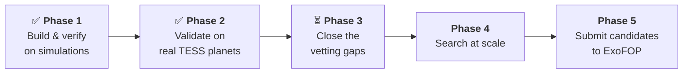
```mermaid
flowchart LR
    P1["✅ <b>Phase 1</b><br/>Build & verify<br/>on simulations"] --> P2["✅ <b>Phase 2</b><br/>Validate on<br/>real TESS planets"]
    P2 --> P3["⏳ <b>Phase 3</b><br/>Close the<br/>vetting gaps"]
    P3 --> P4["<b>Phase 4</b><br/>Search at scale"]
    P4 --> P5["<b>Phase 5</b><br/>Submit candidates<br/>to ExoFOP"]
```

**Phase 1: build and verify on simulations (done).**

- [x] Data download, cleaning, caching and detrending
- [x] Iterative BLS with physical grids, red-noise S/N and trial-corrected thresholds
- [x] batman + emcee fitting with derived planet properties
- [x] Six-test eclipsing-binary vetting with verdicts
- [x] Parallel, resumable injection–recovery
- [x] Synthetic benchmark, false-alarm calibration, search-cost benchmark
- [x] CLI, report folders, CI, auto-generated documentation

**Phase 2: validate on real TESS data (done).**

- [x] Recover published period, depth and radius for confirmed TESS planets
  (`validate_known_planets.py`): all 10 found around five stars
- [x] A data-coverage vetting test, added after the first real run produced a false alarm
  made of events at the edges of data segments
- [x] Real-light-curve injection–recovery: 80.6 % of 2,048 injections into two sectors of
  HD 21749 recovered
- [x] Verdicts on 3–5 unresolved TOI planet candidates (`vet_toi_candidates.py`): five
  vetted
- [x] Measure the false-alarm rate on real stars without known planets or TOIs, whose light
  curves contain momentum dumps, scattered light and other systematics the simulator lacks
  (`measure_real_false_alarms.py`)
- [x] Check the vetting against TOIs the follow-up team has resolved
  (`calibrate_vetting_on_tois.py`): no confirmed planet rejected, two thirds of the detected
  false positives caught (half before the centroid test), no threshold needed to move

**Phase 3: close the vetting gaps (in progress).**

- [x] **Pixel-level centroid test** from target-pixel files: where the flux drops during
  transit, located with the TESS pixel response function. Among the resolved TOIs it catches
  5 of 12 false positives, 2 of them missed by every other test, and rejects no planet; blends
  closer than about 9″ remain out of its reach
- [ ] **Statistical validation** with a false-positive-probability tool such as TRICERATOPS,
  combining the light curve with the star's neighborhood and Gaia data
- [x] Reject single transits hit by instrumental systematics before the fit and the vetting,
  and measure each transit against its own surroundings in the odd/even test (a transit on a
  ramp made HD 21749 b fail)
- [x] Mask deep dips at the edges of the data before the search, and measure each peak only
  against trial periods that can hold two transits (together they recover HD 21749 c)
- [x] Tell instrumental dips from real transits that fall partly in a gap in the data: mask
  only dips next to a long gap (the first mask cost four planets with two or three transits
  among the injections into HD 21749's light curve; three are now found)
- [ ] Fit transit times one by one, so that planets whose transits shift, like TOI-270 c and
  d, are not fitted as smeared, grazing transits
- [x] A density test that a poorly converged fit with two modes cannot dilute (it had let
  L 98-59's eclipsing binary pass)
- [ ] Fits that converge: most real-data chains are shorter than 50 autocorrelation times,
  and the tests that read the posterior inherit its wanderings
- [ ] A detection statistic that copes with several planets of similar strength in a short
  light curve (they hid TOI-1233.01 in two sectors)
- [ ] Limb-darkening priors from stellar-atmosphere tables; eccentric-orbit fits

**Phase 4: search at scale.**

- [x] Batch mode over target lists (`scripts/batch_search.py`): stars chosen by sector and TIC
  values, a resumable run, and a ranked candidate table with safeguards against near-threshold
  false alarms (a margin above the thresholds, at least three transits, the same depth in
  every sector)
- [ ] **Full-frame-image light curves** (TESS-SPOC / QLP): millions of stars observed at
  10- or 30-minute cadence that never got a 2-minute slot
- [ ] Transit Least Squares (limb-darkened template) as a second search engine, and a GPU BLS
  for multi-year baselines
- [ ] **Single- and duo-transit search** for long-period planets that transit once per year
  of TESS coverage
- [ ] Transit-timing-variation search for planets tugged by unseen companions
- [x] Automatic cross-match against the TOI, CTOI and confirmed-planet catalogs in the batch
  search, including period multiples whose transits line up

**Phase 5: submit.** Package surviving candidates (ephemeris, depth, vetting report, figures) as
Community TOIs on ExoFOP-TESS. See the next section.

---

## Could this find a new exoplanet?

Yes, in principle. Amateurs and students have done it: citizen-science projects such as
Planet Hunters TESS have turned up candidates the automated pipelines missed, and anyone can
submit a candidate to NASA's follow-up program. But a periodic dip is not a planet, and the path
from one to the other is long. This is what it would take.

### Where undiscovered planets are still hiding in TESS data

The official pipelines (SPOC and MIT's QLP) are excellent, but they are general-purpose and
work at huge scale. Planets slip through in predictable places:

| hiding place | why the official search can miss it | what this pipeline would need |
|---|---|---|
| **Additional planets in known systems** | after the obvious planet is found, fainter siblings can go unsearched | already does iterative masked search; run it on TOI hosts |
| **Stars with many sectors** (near the ecliptic poles) | small planets only emerge after stacking years of data | multi-year period grid already built; needs compute time |
| **Active, spotted stars** | aggressive stellar variability defeats generic detrending | biweight + spot-rejection test; tune per star |
| **Long periods** (> ~50 days) | only one or two transits, often in different years | Phase 4 duo-transit search |
| **Faint stars with only full-frame images** | lower priority for the 2-minute pipeline | Phase 4 FFI support |

Small **M-dwarf hosts** are the best bet: the [depth figure above](#the-science-in-two-minutes)
shows that an Earth-sized planet around a 0.38 R☉ star makes a ~580 ppm dip, 7× deeper than
around the Sun. Those planets are also the best targets for atmosphere studies with JWST.

### The discovery funnel

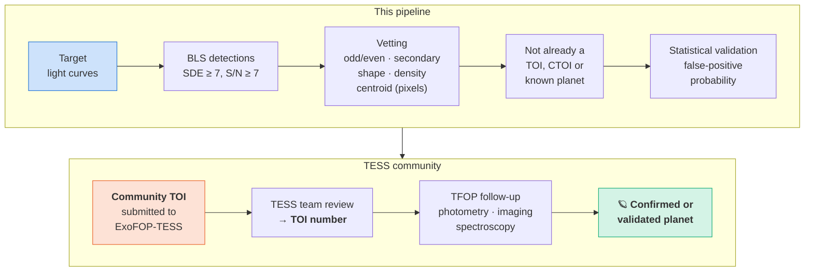
```mermaid
flowchart TB
    subgraph R["This pipeline"]
        direction LR
        A["Target<br/>light curves"] --> B["BLS detections<br/>SDE ≥ 7, S/N ≥ 7"] --> C["Vetting<br/>odd/even · secondary<br/>shape · density<br/>centroid (pixels)"] --> D["Not already a<br/>TOI, CTOI or<br/>known planet"] --> E["Statistical validation<br/>false-positive<br/>probability"]
    end
    subgraph T["TESS community"]
        direction LR
        F["<b>Community TOI</b><br/>submitted to<br/>ExoFOP-TESS"] --> G["TESS team review<br/>→ <b>TOI number</b>"] --> H["TFOP follow-up<br/>photometry · imaging<br/>spectroscopy"] --> I["🪐 <b>Confirmed or<br/>validated planet</b>"]
    end
    R --> T

    style A fill:#cde2fb,stroke:#2a78d6
    style F fill:#fde2d6,stroke:#eb6834
    style I fill:#d4f3e6,stroke:#1baf7a
```

The first four boxes are what this repository does today; the catalog check is part of the
[batch search](https://comdex4.github.io/tess-transit-hunter/batch.html), which cross-matches
its candidates with confirmed planets, TOIs and CTOIs. The centroid test finds an eclipsing
binary blended into the target's pixels when the binary is more than about 9″ from the target;
closer ones still look exactly like a planet. A false-positive probability is the biggest
missing piece: it weighs the scenarios that remain, such as a binary too close to resolve,
using the transit's shape and the stars around the target. After that, the process runs through
the TESS community:

1. **Submit a CTOI.** Anyone who finds a planet candidate in TESS data can submit it to
   [ExoFOP-TESS](https://exofop.ipac.caltech.edu/tess/) as a Community TOI. The TESS TOI team
   reviews it and, if it meets their standard, gives it a TOI number
   ([TOI release FAQ](https://tess.mit.edu/toi-releases/toi-release-faqs/)).
2. **Follow-up.** The TESS Follow-up Observing Program (TFOP) coordinates ground-based
   photometry (is the dip on the target star?), high-resolution imaging (is there a hidden
   companion star?) and spectroscopy (is the host a single star, and what is the planet's mass?).
3. **Confirmation or validation.** A radial-velocity mass measurement confirms a planet. Where
   that is out of reach, a statistical false-positive probability below ~1 % can "validate" it.

### What a credible first result would look like

The realistic near-term goal is not a headline discovery. It is a pipeline that (1) recovers
known TESS planets to within their published uncertainties, (2) independently agrees with the
TESS team's verdicts on TOIs that have already been resolved, and then (3) produces a short,
ranked list of new candidates around nearby M dwarfs, each with a vetting report strong enough
to submit as a CTOI. Phases 2–5 of the roadmap are that plan.

---

## Limitations

- **Real-data samples are small, and some numbers are still synthetic.** The validation
  covers five stars, the candidate verdicts five TOIs and the real completeness two sectors of
  one star. The false-alarm rates and the vetting thresholds come from simulations,
  which lack momentum-dump jumps, scattered light and sector-to-sector offsets, so the
  synthetic completeness is an upper limit and the false-alarm rates are lower limits.
- **Instrumental systematics decide some real outcomes.** In the first real-data run, one
  transit on an instrumental ramp made HD 21749 b fail the odd/even test, and a few deep,
  isolated dips hid HD 21749 c from the search although it is in the data at S/N 16.6. Both
  are now handled, but other systematics the pipeline has not met could still decide a
  verdict.
- **One period per planet.** The search and the fit fold every transit on a single period.
  TOI-270 c's and d's transit times shift by several minutes between observing seasons, and
  both fits prefer longer, more grazing transits than the published ones: d fails the
  density test and c gets a density warning.
- **Blends closer than the pixels resolve.** The centroid test works from TESS's 21″ pixels:
  even at best it cannot tell apart positions less than about 9″ apart (3σ), and for
  shallow dips, single sectors or saturated stars the limit is much wider (87″ for pi Men).
  An eclipsing binary closer to the target than that, or bound to it, looks like a planet on
  the target. "Passes all tests" means *consistent with a planet on the target*, not
  *confirmed*.
- **At least two transits** are required; single-transit planets are missed by design.
- **Circular orbits** are assumed in the fit, which is why the density test only fails beyond
  a factor of 5.
- **Spotted stars observed for several sectors** give false alarms at the rotation period. In the
  three-sector moderate-activity simulations, 11 of 150 noise-only light curves did, 10 of them
  at the rotation period or its harmonics. The vetting flags these but cannot rule them out.
- **MCMC chains for shallow transits** often hit the step limit before 50 autocorrelation times
  (11 of the 12 fits in the validation did). Medians and 68 % intervals still matched the truth
  in the synthetic benchmark, but posterior tails are less reliable.

Full discussion: [docs/limitations.md](docs/limitations.md).

---

## Tests and CI

```bash
pytest          # synthetic data only, no network; a few minutes
ruff check src tests scripts && ruff format --check src tests scripts
```

The tests cover data cleaning and caching (with a faked lightkurve), detrending, BLS recovery
of injected signals (including near-resonant pairs and noise-only light curves), fit accuracy
on noiseless models, each vetting test on synthetic planets and eclipsing binaries,
injection–recovery bookkeeping, archive-table parsing, and the CLI end to end. GitHub Actions
runs ruff and pytest on Python 3.11 and 3.12 for every push and pull request
([`.github/workflows/ci.yml`](.github/workflows/ci.yml)).

## Documentation site

The full write-up (methods, validation, completeness, candidate verdicts, limitations) lives
in [`docs/`](docs/) as a Jekyll site for GitHub Pages:
**<https://comdex4.github.io/tess-transit-hunter/>**. To publish it, go to
**Settings → Pages → Build and deployment**, choose *Deploy from a branch*, and select the
default branch and the `/docs` folder.

## Repository layout

```
src/transit_hunter/   data, detrend, search, fit, vet, inject, catalog, validation,
                      pipeline, cli, synthetic (simulator), models, plotting, utils
scripts/              analyses listed above
notebooks/            validation notebook
tests/                offline pytest suite
results/              outputs of the analysis scripts (JSON / Markdown / figures)
docs/                 GitHub Pages write-up; README diagrams in docs/assets/readme/
```

## Key references

Kovács, Zucker & Mazeh 2002 (BLS) · Kreidberg 2015 (batman) · Foreman-Mackey et al. 2013
(emcee) · Hippke et al. 2019 (wotan) · Kipping 2013 (limb darkening) · Pont, Zucker & Queloz
2006 (red noise) · Coughlin et al. 2016 (Kepler Robovetter) · Seager & Mallén-Ornelas 2003
(stellar density from transits) · Ofir 2014 (period sampling) · Stassun et al. 2019 (TIC).
Full list in [docs/methods.md](docs/methods.md#references).

This project uses data collected by the TESS mission, funded by NASA's Science Mission
Directorate, and obtained from the Mikulski Archive for Space Telescopes (MAST).

## License

MIT, see [LICENSE](LICENSE).
