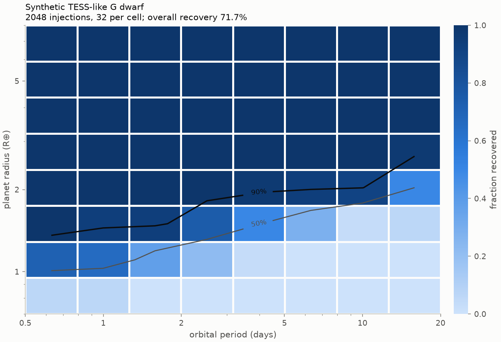
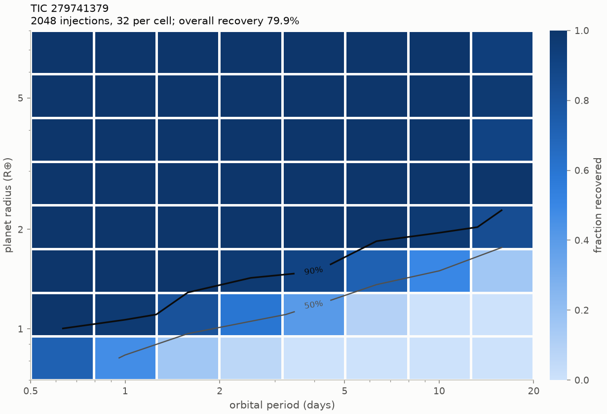

Synthetic transits are multiplied into a light curve **before detrending**, and the full
detrend + iterative BLS search is run exactly as for a real target
(`scripts/run_injection_recovery.py`; method in [Methods](methods.md#injectionrecovery-injectpy)).
An injection counts as recovered only if a **detected** signal matches its period to
within 1 % and a mid-transit time falls within half a transit duration of an injected
transit. Detections at 1/2, 2, 1/3, or 3 times the period are recorded separately as aliases
and are not counted as recoveries. Tables list the percentage recovered, with the number
recovered / injected in brackets. The table is the exact numerical twin of the figure.

## Synthetic TESS-like light curve

A simulated two-sector light curve of a Sun-like star with white noise, correlated noise,
and rotational modulation. It has no instrumental systematics, so this map is an **upper
limit** on real-data completeness at the same noise level.

  

    <h3>Interactive map</h3>
    
{{ site.data.completeness.label }} · hover over a cell for the counts

  

  

    

    
0 %<i></i>100 %

  

<figure class="fig">
  
  <figcaption><strong>Recovery curves.</strong> The same injections, grouped into four period ranges. The explanation of the shape, and the method, are on the <a href="pipeline/inject.html">injection–recovery page</a>.</figcaption>
</figure>

The static figure and the exact table, generated from `results/`:

<!-- BEGIN: completeness_synthetic -->

2048 injections (0.7–8 R⊕, 0.5–20 d) into a synthetic TESS-like light curve of a G dwarf: 38020 points over 54.8 days; robust scatter of the flattened light curve 0.5h: 185 ppm, 1h: 140 ppm, 2h: 99 ppm. Overall recovery: 71.7 %; 0 injections were found only at an alias period.

| R_p (R⊕) \ P (d) | 0.5–0.793 | 0.793–1.26 | 1.26–1.99 | 1.99–3.16 | 3.16–5.01 | 5.01–7.95 | 7.95–12.6 | 12.6–20 |
|---|---|---|---|---|---|---|---|---|
| 5.9–8 | 100% (32/32) | 100% (32/32) | 100% (32/32) | 100% (32/32) | 100% (32/32) | 100% (32/32) | 100% (32/32) | 100% (32/32) |
| 4.35–5.9 | 100% (32/32) | 100% (32/32) | 100% (32/32) | 100% (32/32) | 100% (32/32) | 100% (32/32) | 100% (32/32) | 100% (32/32) |
| 3.21–4.35 | 100% (32/32) | 100% (32/32) | 100% (32/32) | 100% (32/32) | 100% (32/32) | 100% (32/32) | 100% (32/32) | 100% (32/32) |
| 2.37–3.21 | 100% (32/32) | 100% (32/32) | 100% (32/32) | 100% (32/32) | 100% (32/32) | 100% (32/32) | 100% (32/32) | 97% (31/32) |
| 1.75–2.37 | 100% (32/32) | 100% (32/32) | 100% (32/32) | 100% (32/32) | 97% (31/32) | 94% (30/32) | 91% (29/32) | 50% (16/32) |
| 1.29–1.75 | 100% (32/32) | 94% (30/32) | 94% (30/32) | 75% (24/32) | 50% (16/32) | 28% (9/32) | 3% (1/32) | 6% (2/32) |
| 0.949–1.29 | 72% (23/32) | 66% (21/32) | 38% (12/32) | 22% (7/32) | 3% (1/32) | 0% (0/32) | 0% (0/32) | 0% (0/32) |
| 0.7–0.949 | 6% (2/32) | 6% (2/32) | 0% (0/32) | 0% (0/32) | 0% (0/32) | 0% (0/32) | 0% (0/32) | 0% (0/32) |

<!-- END: completeness_synthetic -->

## Real TESS light curve

The same injections, into two sectors (1 and 2) of HD 21749 (TIC 279741379), a K dwarf of
0.71 R☉. The transits of its two known planets are masked first, so that they are neither
recovered nor mistaken for injections. Two sectors match the synthetic light curve above.



  

    <h3>Interactive map</h3>
    
{{ site.data.completeness_real.label }} · hover over a cell for the counts

  

  

    

    
0 %<i></i>100 %

  



<!-- BEGIN: completeness_real -->

2048 injections (0.7–8 R⊕, 0.5–20 d) into the SPOC 2-minute light curve of TIC 279741379, sectors 1, 2, known planets masked: 36526 points over 56.2 days; robust scatter of the flattened light curve 0.5h: 112 ppm, 1h: 88 ppm, 2h: 73 ppm. Overall recovery: 79.9 %; 3 injections were found only at an alias period.

| R_p (R⊕) \ P (d) | 0.5–0.793 | 0.793–1.26 | 1.26–1.99 | 1.99–3.16 | 3.16–5.01 | 5.01–7.95 | 7.95–12.6 | 12.6–20 |
|---|---|---|---|---|---|---|---|---|
| 5.9–8 | 100% (32/32) | 100% (32/32) | 100% (32/32) | 100% (32/32) | 100% (32/32) | 100% (32/32) | 100% (32/32) | 94% (30/32) |
| 4.35–5.9 | 100% (32/32) | 100% (32/32) | 100% (32/32) | 100% (32/32) | 100% (32/32) | 100% (32/32) | 100% (32/32) | 97% (31/32) |
| 3.21–4.35 | 100% (32/32) | 100% (32/32) | 100% (32/32) | 100% (32/32) | 100% (32/32) | 100% (32/32) | 100% (32/32) | 91% (29/32) |
| 2.37–3.21 | 100% (32/32) | 100% (32/32) | 100% (32/32) | 100% (32/32) | 100% (32/32) | 100% (32/32) | 100% (32/32) | 100% (32/32) |
| 1.75–2.37 | 100% (32/32) | 100% (32/32) | 100% (32/32) | 100% (32/32) | 100% (32/32) | 100% (32/32) | 97% (31/32) | 84% (27/32) |
| 1.29–1.75 | 100% (32/32) | 100% (32/32) | 100% (32/32) | 97% (31/32) | 91% (29/32) | 72% (23/32) | 50% (16/32) | 16% (5/32) |
| 0.949–1.29 | 100% (32/32) | 97% (31/32) | 81% (26/32) | 59% (19/32) | 41% (13/32) | 9% (3/32) | 0% (0/32) | 0% (0/32) |
| 0.7–0.949 | 72% (23/32) | 47% (15/32) | 16% (5/32) | 6% (2/32) | 0% (0/32) | 0% (0/32) | 0% (0/32) | 0% (0/32) |

<!-- END: completeness_real -->

### Real against synthetic

Overall, 79.9 % of the injections into HD 21749's light curve are recovered, against 71.7 %
for the synthetic G dwarf. Below about 2.4 R⊕ the real map is the more complete, radius for
radius, but not because real data are cleaner. HD 21749 is smaller than the simulated star (0.71 against
1.0 R☉), so the same planet makes a transit about twice as deep, and its light curve is
quieter (88 against 140 ppm per hour). The two maps therefore do not show what real
systematics cost; that would need injections into a simulated light curve of the same star.

Two differences do come from the real data (`injections.csv` in each folder):

* **Gaps.** Eight injections at 12.6–20 days had fewer than two transits in the data,
  against none in the synthetic light curve, because sector gaps and the masked transits
  of HD 21749's own planets remove data. They account for four of the six misses among
  planets larger than 3.2 R⊕.
* **Aliases.** Three injections were found only at an alias of their period, against
  none in the synthetic run.

Two sectors are also far less than the 15 the validation searched for this star. At the
size and period of HD 21749 c (0.89 R⊕, 7.8 days), no injection is recovered in two
sectors (0 of 32 in that cell), while in 15 sectors the planet has S/N 16.6
([Validation](validation.md#what-the-real-data-showed)). More data would have made it
detectable. It was missed for another reason.

### Interpreting the maps

* Completeness falls with radius because depth scales as (Rp/R*)². It falls with period
  because fewer transits are observed, and the S/N grows only as the square root of their
  number. In light curves with long gaps, some long-period injections also have fewer
  than the two transits a detection requires (`n_transits_in_data` in `injections.csv`).
* The limiting S/N is set by the detection criteria (SDE ≥ 7, red-noise S/N ≥ max(7,
  trial-corrected level)), not by the injection grid.
* The per-injection results, including the found period, S/N, SDE, and the number of
  injected transits that fell in the data, are in `injections.csv` in each results folder.
