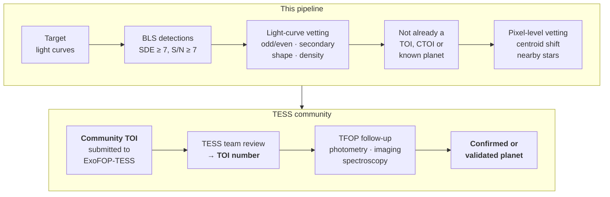

## Why there is still room

As of June 2026 the TESS team counts **8,035 TESS Objects of Interest**, **897 confirmed
planets** and **2,098 known false positives**
([TESS planet count](https://tess.mit.edu/tess-planet-count/)). Thousands of candidates are
still unresolved. Every star TESS has observed also has a light curve that could hide
signals the official searches passed over. Citizen-science projects such as Planet Hunters
TESS have turned up candidates that the automated pipelines missed, and anyone can submit a
candidate to NASA's follow-up program.

The official pipelines (SPOC and MIT's QLP) are excellent, but they are general-purpose and
run at enormous scale. Planets slip through in predictable places:

| hiding place | why it can be missed | what this pipeline needs |
|---|---|---|
| **More planets in known systems** | once the obvious planet is found, fainter siblings may go unsearched | already does iterative masked search; run it on TOI hosts |
| **Stars with many sectors** near the ecliptic poles | small planets only appear after stacking years of data | multi-year period grid already built; needs compute time |
| **Active, spotted stars** | strong variability defeats generic detrending | biweight + starspot test; tune per star |
| **Long periods** (≳ 50 days) | only one or two transits, often a year apart | a duo-transit search (Phase 4) |
| **Stars with only full-frame images** | not in the 2-minute pipeline | FFI light-curve support (Phase 4) |

Small **M dwarfs** are the best hunting ground. An Earth-sized planet around a 0.38 R☉ star
makes a transit about 580 ppm deep, roughly seven times deeper than around the Sun, and such
planets are prime targets for studying atmospheres with JWST.

## From a dip to a planet

The first three boxes are what the pipeline does today. The catalogue cross-match is a small
addition. **Pixel-level vetting is the biggest missing piece**: without it, a background
eclipsing binary blended into the target's pixels looks exactly like a planet. After that the
process runs through the TESS community:

1. **Submit a Community TOI (CTOI).** Anyone who finds a planet candidate in TESS data can
   submit it to [ExoFOP-TESS](https://exofop.ipac.caltech.edu/tess/). The TESS TOI team
   reviews it and, if it meets their standard, assigns it a TOI number
   ([TOI release FAQ](https://tess.mit.edu/toi-releases/toi-release-faqs/)).
2. **Follow-up.** The TESS Follow-up Observing Program (TFOP) coordinates ground-based
   photometry (is the dip on the target star?), high-resolution imaging (is there a hidden
   companion?) and spectroscopy (is the host a single star, and what is the planet's mass?).
3. **Confirmation or validation.** A radial-velocity mass measurement confirms a planet. When
   that isn't possible, a statistical false-positive probability below about 1 % can
   *validate* it.

## Roadmap

<ol class="roadmap">
  <li class="is-done">
    ✓
    <h3>Build and verify on simulations done</h3>
    
The full pipeline, tested where the right answer is known.

    <ul>
      <li>Data download, cleaning, caching and detrending</li>
      <li>Iterative BLS with physical grids, red-noise S/N and trial-corrected thresholds</li>
      <li>batman + emcee fitting with derived planet properties</li>
      <li>Six-test eclipsing-binary vetting</li>
      <li>Parallel, resumable injection–recovery; false-alarm and search-cost benchmarks</li>
      <li>CLI, report folders, CI, and this site, generated from <code>results/</code></li>
    </ul>
  </li>
  <li class="is-next">
    2
    <h3>Validate on real TESS data next</h3>
    
The code is written and tested against mocked archives; it needs a machine with access to MAST.

    <ul>
      <li>Recover published period, depth and radius for confirmed planets (WASP-18, pi Men, TOI-270, L 98-59, HD 21749)</li>
      <li>Real-light-curve injection–recovery, which will be less optimistic than the synthetic map</li>
      <li>Verdicts on unresolved TOI planet candidates</li>
      <li>Re-calibrate false-alarm thresholds on real planet-free light curves with genuine systematics</li>
    </ul>
  </li>
  <li>
    3
    <h3>Close the vetting gaps</h3>
    <ul>
      <li><strong>Pixel-level centroid test</strong> from target-pixel files: does the star's image shift during transit?</li>
      <li><strong>Statistical validation</strong> with a false-positive-probability tool such as TRICERATOPS, using Gaia neighbours</li>
      <li>Limb-darkening priors from stellar-atmosphere tables; eccentric-orbit fits</li>
      <li>Calibrate the vetting thresholds on labelled planets and false positives from the TOI catalogue</li>
    </ul>
  </li>
  <li>
    4
    <h3>Search at scale</h3>
    <ul>
      <li>Batch mode over target lists (for example every 2-minute M dwarf in a region), producing a ranked candidate table</li>
      <li>Full-frame-image light curves (TESS-SPOC, QLP) for millions of stars without 2-minute data</li>
      <li>Transit Least Squares as a second search engine; GPU BLS for multi-year baselines</li>
      <li>Single- and duo-transit search for long-period planets; transit-timing-variation search</li>
      <li>Automatic cross-match with the TOI, CTOI and confirmed-planet catalogues</li>
    </ul>
  </li>
  <li>
    5
    <h3>Submit candidates</h3>
    
Package survivors (ephemeris, depth, vetting report, figures) as Community TOIs on ExoFOP-TESS.

  </li>
</ol>

## What a credible first result looks like

The realistic near-term goal is not a headline discovery. It is a pipeline that:

1. recovers known TESS planets within their published uncertainties;
2. independently agrees with the TESS team's verdicts on TOIs that have already been resolved;
3. then produces a short, ranked list of **new** candidates around nearby M dwarfs, each with a
   vetting report strong enough to submit as a CTOI.

Phases 2 to 5 above are that plan.
