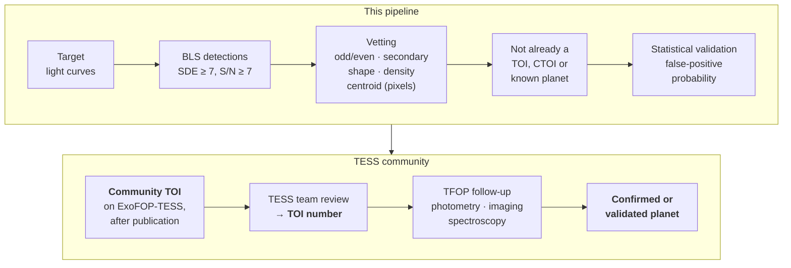

## Why there is still room

As of June 2026 the TESS team counts **8,035 TESS Objects of Interest**, **897 confirmed
planets** and **2,098 known false positives**
([TESS planet count](https://tess.mit.edu/tess-planet-count/)). Thousands of candidates are
still unresolved. Every star TESS has observed also has a light curve that could hide
signals the official searches passed over. Citizen-science projects such as Planet Hunters
TESS have turned up candidates that the automated pipelines missed, and this pipeline's own
batch search has produced one: [G 249-11](findings.md).

The official pipelines (SPOC and MIT's QLP) are excellent, but they are general-purpose and
run at enormous scale. Planets slip through in predictable places:

| hiding place | why it can be missed | what this pipeline needs |
|---|---|---|
| **More planets in known systems** | once the obvious planet is found, fainter siblings may go unsearched | already does iterative masked search; run it on TOI hosts |
| **Stars with many sectors** near the ecliptic poles | small planets only appear after stacking years of data | multi-year period grid already built; needs compute time |
| **Active, spotted stars** | strong variability defeats generic detrending | biweight + starspot test; tune per star |
| **Long periods** (≳ 50 days) | only one or two transits, often a year apart | a duo-transit search (Phase 4) |
| **Stars with only full-frame images** | not in the 2-minute pipeline | FFI light-curve support (Phase 4) |

Small **M dwarfs** are the best hunting ground. An Earth-sized planet around a 0.38 R☉ star
makes a transit about 580 ppm deep, roughly seven times deeper than around the Sun, and such
planets are prime targets for studying atmospheres with JWST.

## From a dip to a planet

```mermaid
flowchart TB
    subgraph R["This pipeline"]
        direction LR
        A["Target<br/>light curves"] --> B["BLS detections<br/>SDE ≥ 7, S/N ≥ 7"] --> C["Vetting<br/>odd/even · secondary<br/>shape · density<br/>centroid (pixels)"] --> D["Not already a<br/>TOI, CTOI or<br/>known planet"] --> E["Statistical validation<br/>false-positive<br/>probability"]
    end
    subgraph T["TESS community"]
        direction LR
        F["<b>Community TOI</b><br/>on ExoFOP-TESS,<br/>after publication"] --> G["TESS team review<br/>→ <b>TOI number</b>"] --> H["TFOP follow-up<br/>photometry · imaging<br/>spectroscopy"] --> I["<b>Confirmed or<br/>validated planet</b>"]
    end
    R --> T
```

The first four boxes are what the pipeline does today; the catalog check is part of the
[batch search](batch.md), which cross-matches its candidates with confirmed planets, TOIs and
CTOIs. The centroid test finds an eclipsing binary blended into the target's pixels when the
binary is more than about 9″ from the target; closer ones still look exactly like a planet. **A
false-positive probability is the biggest missing piece**: it weighs the scenarios that remain,
such as a binary too close to resolve, using the transit's shape and the stars around the
target. After that the process runs through the TESS community:

1. **Report and publish.** [ExoFOP-TESS](https://exofop.ipac.caltech.edu/tess/) hosts
   Community TOIs (CTOIs), which the TESS TOI team reviews and, if they meet its standard,
   gives a TOI number ([TOI release FAQ](https://tess.mit.edu/toi-releases/toi-release-faqs/)).
   ExoFOP only accepts community candidates that have been accepted and published in the
   refereed literature
   ([upload guidelines](https://exofop.ipac.caltech.edu/tess/candidate_help.php)), so an
   unpublished candidate goes first to ExoFOP's support team or to professional astronomers
   who can arrange its follow-up and publication.
2. **Follow-up.** The TESS Follow-up Observing Program (TFOP) coordinates ground-based
   photometry (is the dip on the target star?), high-resolution imaging (is there a hidden
   companion?) and spectroscopy (is the host a single star, and what is the planet's mass?).
3. **Confirmation or validation.** A radial-velocity mass measurement confirms a planet. When
   that isn't possible, a statistical false-positive probability below about 1 % can
   *validate* it.

## Roadmap

<ol class="roadmap">
  <li class="is-done">
    ✓
    <h3>Build and verify on simulations done</h3>
    
The full pipeline, tested where the right answer is known.

    <ul>
      <li>Data download, cleaning, caching and detrending</li>
      <li>Iterative BLS with physical grids, red-noise S/N and trial-corrected thresholds</li>
      <li>batman + emcee fitting with derived planet properties</li>
      <li>Six-test eclipsing-binary vetting</li>
      <li>Parallel, resumable injection–recovery; false-alarm and search-cost benchmarks</li>
      <li>CLI, report folders, CI, and this site, generated from <code>results/</code></li>
    </ul>
  </li>
  <li class="is-done">
    ✓
    <h3>Validate on real TESS data done</h3>
    
Run on real TESS data in September 2026: confirmed planets, planet candidates, TOIs the follow-up team has resolved, stars without known planets, and injections into a real light curve.

    <ul>
      <li>✓ Recover published period, depth and radius for confirmed planets: {{ site.data.stats.validation.n_recovered }} of {{ site.data.stats.validation.n_planets }} found around WASP-18, pi Men, TOI-270, L 98-59 and HD 21749 (<a href="{{ '/validation.html#what-the-real-data-showed' | relative_url }}">what the real data showed</a>)</li>
      <li>✓ A data-coverage vetting test, added after the first real run produced a false alarm made of events at the edges of data segments</li>
      <li>✓ Real-light-curve injection–recovery: {{ site.data.stats.completeness_real.overall_pct | round: 1 }} % of {{ site.data.stats.completeness_real.n_injections }} injections into two sectors of HD 21749 recovered (<a href="{{ '/completeness.html#real-against-synthetic' | relative_url }}">compared with the synthetic map</a>)</li>
      <li>✓ Verdicts on {{ site.data.stats.candidates.n_tois }} unresolved TOI planet candidates (<a href="{{ '/candidates.html#what-the-verdicts-rest-on' | relative_url }}">what they rest on</a>)</li>
      <li>✓ False alarms measured on {{ site.data.stats.false_alarms_real.n_stars }} real stars without known planets or TOIs: {{ site.data.stats.false_alarms_real.n_with_detection }} gave a detection (<a href="{{ '/validation.html#false-alarms-on-real-stars' | relative_url }}">details</a>)</li>
      <li>✓ Vetting checked against {{ site.data.stats.toi_calibration.n_planets | plus: site.data.stats.toi_calibration.n_false_positives }} TOIs resolved by the follow-up team: {{ site.data.stats.toi_calibration.planets_rejected }} confirmed planets rejected, {{ site.data.stats.toi_calibration.fps_rejected }} of {{ site.data.stats.toi_calibration.n_false_positives }} false positives caught (<a href="{{ '/validation.html#what-the-resolved-tois-showed' | relative_url }}">details</a>)</li>
    </ul>
  </li>
  <li class="is-next">
    3
    <h3>Close the vetting gaps in progress</h3>
    <ul>
      <li>✓ <strong>Pixel-level centroid test</strong> from target-pixel files: where the flux drops during transit, located with the TESS pixel response function (among the resolved TOIs it catches 5 of 12 false positives, 2 of them missed by every other test, and rejects no planet)</li>
      <li>✓ <strong>Momentum-dump test</strong>: fail a signal whose dip comes from the moments TESS fires its thrusters, which can shift light between neighboring stars' apertures</li>
      <li><strong>Statistical validation</strong> with a false-positive-probability tool such as TRICERATOPS, using Gaia neighbors</li>
      <li>✓ Reject single transits hit by instrumental systematics before the fit and the vetting; measure each transit against its own surroundings in the odd/even test</li>
      <li>✓ Mask deep dips at the edges of the data before the search, and measure each peak only against trial periods that can hold two transits (together they recover HD 21749 c)</li>
      <li>✓ Tell instrumental dips from real transits that fall partly in a gap in the data: mask only dips next to a long gap (the first mask cost four planets with two or three transits among the injections into HD 21749's light curve; three are now found)</li>
      <li>Fit transit times one by one, so that planets whose transits shift, like TOI-270 c and d, are not fitted as smeared, grazing transits</li>
      <li>✓ A density test that a poorly converged fit with two modes cannot dilute (it had let L 98-59's eclipsing binary pass)</li>
      <li>Fits that converge: most real-data chains are shorter than 50 autocorrelation times, and the tests that read the posterior inherit their wanderings</li>
      <li>✓ Check the vetting thresholds against planets and false positives the TOI follow-up team has resolved (no threshold needed to move)</li>
      <li>A detection statistic that copes with several planets of similar strength in a short light curve (they hid TOI-1233.01 in two sectors)</li>
      <li>Limb-darkening priors from stellar-atmosphere tables; eccentric-orbit fits</li>
    </ul>
  </li>
  <li class="is-next">
    4
    <h3>Search at scale in progress</h3>
    <ul>
      <li>✓ <strong>Batch mode</strong> over target lists, with a ranked candidate table and safeguards against near-threshold false alarms (<a href="{{ '/batch.html' | relative_url }}">batch search</a>)</li>
      <li>✓ Automatic cross-match with the TOI, CTOI and confirmed-planet catalogs, including period multiples whose transits line up</li>
      <li>✓ <strong>Seven years of TESS data searched</strong>: M dwarfs with 2-minute light curves in sectors 1–99, up to 1,000 per year, and all 76 signals listed for review checked by hand (<a href="{{ '/findings.html' | relative_url }}">findings</a>)</li>
      <li>✓ <strong>Other-years check</strong> (<code>scripts/check_other_years.py</code>): a candidate's star is searched in its other TESS years, with full-frame-image light curves where there are no 2-minute data. Checks of this kind settled most of the 87 signals checked, and this one recovered G 249-11 independently</li>
      <li>Run the other-years check automatically on every signal a batch lists for review</li>
      <li>Flag known eclipsing binaries (from the TESS eclipsing-binary catalog) and spacecraft events that dim many stars at the same moment; both turned up repeatedly in the batch results</li>
      <li>Flag candidates whose period is a multiple of a short-period variation of the star, below the search's 0.5-day limit</li>
      <li>Full-frame-image light curves (TESS-SPOC, QLP) as search input, for millions of stars without 2-minute data</li>
      <li>Transit Least Squares as a second search engine; GPU BLS for multi-year baselines</li>
      <li>Single- and duo-transit search for long-period planets; transit-timing-variation search</li>
    </ul>
  </li>
  <li class="is-next">
    5
    <h3>Report candidates for follow-up started</h3>
    <ul>
      <li>✓ First candidate written up: G 249-11 (TIC 417732194), with every number reproducible from <code>results/g249-11</code> (<a href="{{ '/findings.html' | relative_url }}">findings</a>)</li>
      <li>Share it with ExoFOP-TESS and with professional astronomers who can arrange follow-up: ground-based transit photometry, high-resolution imaging and radial velocities</li>
      <li>A refereed publication, which ExoFOP requires before a community candidate can be uploaded as a Community TOI (<a href="https://exofop.ipac.caltech.edu/tess/candidate_help.php">upload guidelines</a>)</li>
    </ul>
  </li>
</ol>

## What a credible first result looks like

The realistic near-term goal is not a headline discovery. It is a pipeline that:

1. recovers known TESS planets within their published uncertainties;
2. independently agrees with the TESS team's verdicts on TOIs that have already been resolved;
3. then produces a short, ranked list of **new** candidates around nearby M dwarfs, each with a
   vetting report strong enough for professional follow-up.

Phases 2 to 5 above are that plan. The first two are done, and the third has produced its
first candidate, [G 249-11](findings.md).
