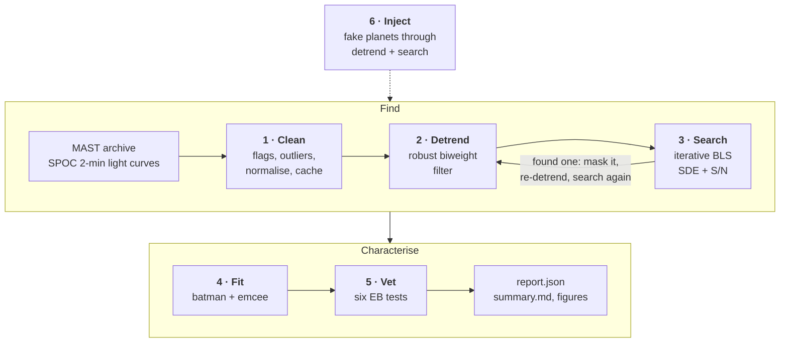

<div class="steps-grid">

  <a class="step-card" href="{{ st.slug | append: '.html' }}">
    <span class="step-card__n">0{{ st.n }}</span>
    <h3>{{ st.title }}</h3>
    <p>{{ st.blurb }}</p>
    <span class="step-card__mod">{{ st.module }}</span>
  </a>

</div>

## What comes out

Every run writes a folder, `reports/TIC<ID>/`:

| file | contents |
|---|---|
| `report.json` | every number: target, stellar parameters, noise, all search iterations, posterior summaries, derived quantities, vetting tests, configuration, software versions, data provenance |
| `summary.md` | human-readable summary with the vetting reasoning |
| `detrending.png` | raw flux with trend, flattened flux |
| `search_summary.png`, `periodogram_<n>.png`, `fold_<n>.png` | BLS periodograms and folded light curves per iteration |
| `fit_<n>.png`, `corner_<n>.png` | best-fitting model with residuals; posterior corner plot |
| `vetting_<n>.png` | odd/even, phase 0.5, transit shape, stellar density |

A complete example, a simulated three-planet M-dwarf system, is in
[`results/synthetic_benchmark/SYN-3/`]({{ site.github_url }}/tree/main/results/synthetic_benchmark/SYN-3).
The figures on the step pages come from that folder and from the eclipsing-binary control
SYN-5.

```bash
transit-hunter run --tic 261136679 --outdir reports/          # one real star (needs MAST access)
transit-hunter demo --outdir reports/                         # offline: synthetic 3-planet system
```

The parameter-by-parameter reference, with every default and citation, is the
[methods reference](../methods.md).
