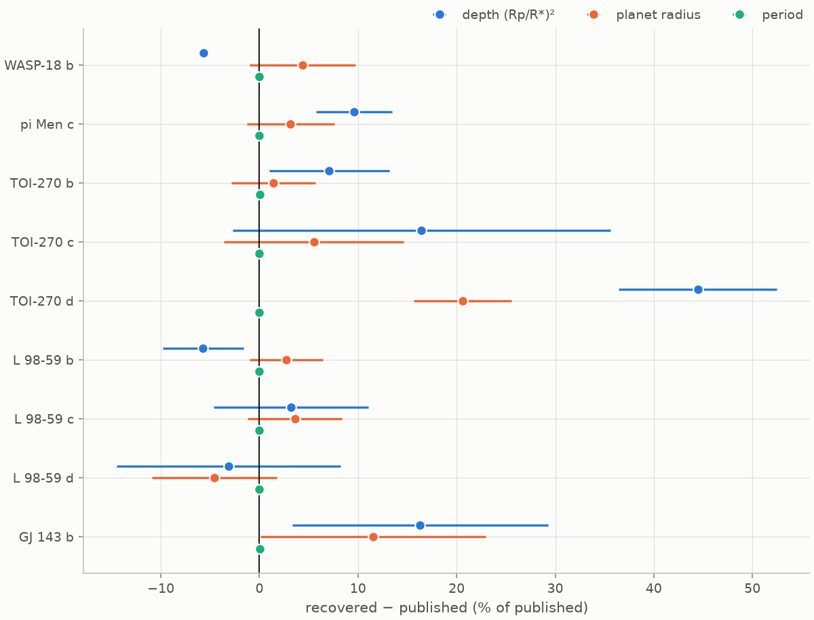
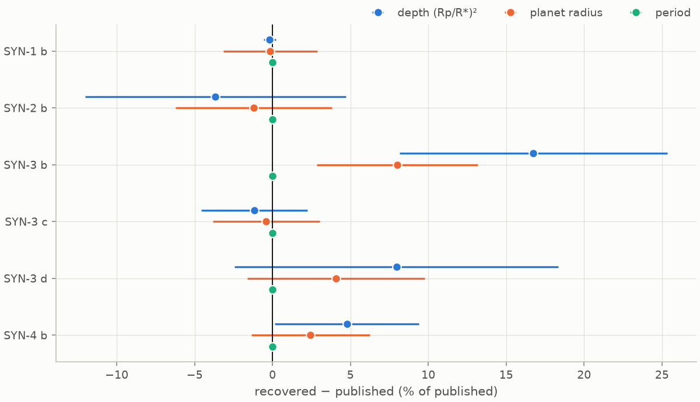
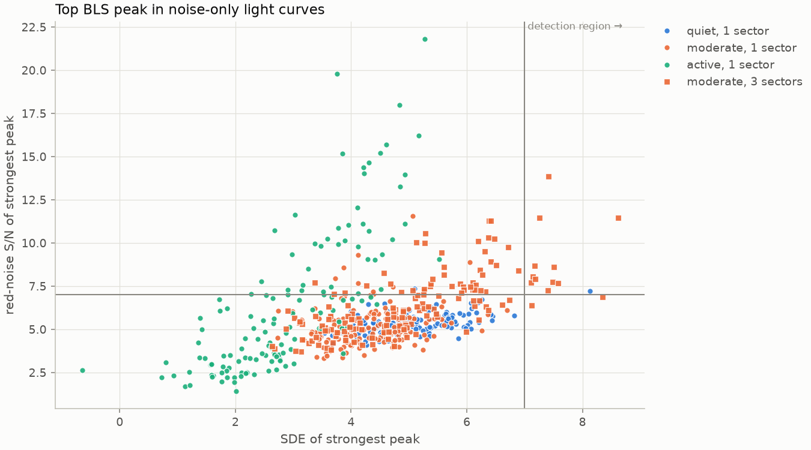

**All tables on this page are
generated by `scripts/update_docs.py` from files in `results/`**, which the scripts named
in each section write.

## Confirmed TESS planets

Recovered versus published period, depth, and radius for confirmed planets that span
short and long periods and large and small sizes. The hosts are WASP-18 (sub-day hot
Jupiter), pi Men (small planet, very bright G dwarf), TOI-270 and L 98-59 (compact M-dwarf
systems, including planets smaller than Earth), and HD 21749 (long-period sub-Neptune).
Reference values are queried from the NASA Exoplanet Archive (`pscomppars`) at run time.
The recovered values are MCMC posterior medians from the full pipeline.

<!-- BEGIN: validation -->

| planet | P published (d) | P recovered (d) | ΔP | depth published (ppm) | depth recovered (ppm) | Δdepth | Rp published (R⊕) | Rp recovered (R⊕) | ΔRp |
|---|---|---|---|---|---|---|---|---|---|
| WASP-18 b | 0.941452 | 0.941452 ± 1e-08 | +0.0000% | 10363 | 9777 ± 27 | -5.7% | 13.90 ± 0.89 | 14.51 ± 0.74 | +4.4% |
| pi Men c | 6.267840 | 6.267822 ± 1e-06 | -0.0003% | 251 | 275 ± 9.6 | +9.6% | 2.02 ± 0.046 | 2.08 ± 0.09 | +3.2% |
| TOI-270 b | 3.359920 | 3.360163 ± 8.6e-07 | +0.0072% | 942 | 1009 ± 57 | +7.1% | 1.28 ± 0.045 | 1.30 ± 0.055 | +1.4% |
| TOI-270 c | 5.660510 | 5.660478 ± 1.1e-06 | -0.0006% | 3136 | 3651 ± 6e+02 | +16.4% | 2.33 ± 0.01 | 2.46 ± 0.21 | +5.5% |
| TOI-270 d | 11.381940 | 11.379700 ± 4.4e-06 | -0.0197% | 2411 | 3483 ± 1.9e+02 | +44.5% | 2.00 ± 0.05 | 2.41 ± 0.099 | +20.6% |
| L 98-59 b | 2.253114 | 2.253114 ± 3.4e-07 | +0.0000% | 666 | 628 ± 27 | -5.7% | 0.84 ± 0.019 | 0.86 ± 0.031 | +2.7% |
| L 98-59 c | 3.690676 | 3.690675 ± 4.1e-07 | -0.0000% | 1568 | 1618 ± 1.2e+02 | +3.2% | 1.33 ± 0.029 | 1.38 ± 0.064 | +3.6% |
| L 98-59 d | 7.450729 | 7.450729 ± 1.4e-06 | +0.0000% | 2116 | 2050 ± 2.4e+02 | -3.1% | 1.63 ± 0.041 | 1.55 ± 0.1 | -4.6% |
| HD 21749 c | 7.789930 | not recovered | | 143 | | | 0.89 | | |
| GJ 143 b | 35.612530 | 35.613408 ± 2.4e-05 | +0.0025% | 1225 | 1425 ± 1.6e+02 | +16.3% | 2.61 ± 0.17 | 2.91 ± 0.3 | +11.5% |

Depth is the geometric depth (Rp/R*)² unless noted; Δ = 100 × (recovered − published) / published.

| host | sectors | signal | P (d) | S/N | known as | vetting verdict | failed tests / warnings |
|---|---|---|---|---|---|---|---|
| WASP-18 | 10 | 1 | 0.94145 | 789.0 | WASP-18 b | planet candidate (passes all tests) | – |
| WASP-18 | 10 | 2 | 0.94145 | 39.0 | – | occultation of signal 1 (phase 0.50), consistent with a planet | – |
| pi Men | 24 | 1 | 6.26781 | 106.6 | pi Men c | planet candidate (passes all tests) | – |
| TOI-270 | 7 | 1 | 5.66048 | 89.1 | TOI-270 c | planet candidate (with caveats) | warnings: rotation |
| TOI-270 | 7 | 2 | 11.37971 | 55.2 | TOI-270 d | likely false positive | failed: density; warnings: rotation |
| TOI-270 | 7 | 3 | 3.36016 | 31.2 | TOI-270 b | planet candidate (passes all tests) | – |
| TOI-270 | 7 | 4 | 56.36665 | 11.9 | no confirmed planet or TOI | likely false positive | failed: coverage; warnings: shape |
| L 98-59 | 27 | 1 | 3.69068 | 132.0 | L 98-59 c | planet candidate (passes all tests) | – |
| L 98-59 | 27 | 2 | 7.45073 | 65.1 | L 98-59 d | planet candidate (passes all tests) | – |
| L 98-59 | 27 | 3 | 2.25312 | 62.5 | L 98-59 b | planet candidate (passes all tests) | – |
| L 98-59 | 27 | 4 | 1.04918 | 36.7 | no confirmed planet or TOI | likely false positive | failed: secondary, density |
| L 98-59 | 27 | 5 | 0.52460 | 9.3 | – | secondary eclipse of an eclipsing binary (with signal 4, phase 0.50) | – |
| HD 21749 | 15 | 1 | 35.61342 | 62.4 | GJ 143 b | likely false positive | failed: odd_even, secondary |
| HD 21749 | 15 | 2 | 193.09210 | 73.7 | no confirmed planet or TOI | likely false positive | failed: secondary, radius, coverage; warnings: shape |

Known as: the confirmed planet (NASA Exoplanet Archive) or, failing that, the TOI and its TFOPWG disposition with the same period to within 1 %.

Confirmed planets that the search missed, measured at their published ephemeris in the light curve of the search's last pass (`scripts/check_missed_planets.py`):

| planet | P (d) | published depth (ppm) | box depth at the published ephemeris (ppm) | transits with data | red-noise S/N (threshold) | search stopped at |
|---|---|---|---|---|---|---|
| HD 21749 c | 7.78993 | 143 | 168 | 45 | 16.6 (7.00) | pass 3: P = 139.05 d, SDE 5.9 |

<!-- END: validation -->

How to read the comparison:

* **Depth** is compared as the geometric depth (Rp/R*)², the one definition shared by the
  fit and the archive. The observed depth of a limb-darkened transit is larger at mid-transit
  and smaller on average.
* **Planet radius** uses the TIC stellar radius, which can differ from the stellar radius
  adopted in the discovery paper. The fitted radius ratio isolates the part of any
  difference that comes from the light curve.
* **Names** are the archive's. It lists HD 21749 as GJ 143, so its outer planet appears as
  GJ 143 b, and pi Men as HD 39091.

### What the real data showed

The search found **9 of the 10** transiting planets that the archive lists for these five
stars, in 7 to 27 sectors of TESS data per star. For eight of the nine the fitted radius
ratio is within 8 % of the published one (median difference 3.5 %, from `validation.json`).
The exception is TOI-270 d, discussed below. Periods agree within 2.7 of the archive's
standard deviations, except for TOI-270 b and d, whose archive periods differ from the
fitted ones by 4.9 and 20 standard deviations. The TOI catalogue's current ephemerides for
the same two planets (TOI-270.03 and .02) agree with the fitted periods to within
5 × 10⁻⁶ days, so the difference lies in the archive's adopted values, not in the fit.

Six planets pass every vetting test, including L 98-59 b, which is smaller than Earth
(0.86 R⊕ fitted, 0.84 R⊕ published). The other four results are the most instructive:

* **HD 21749 c was missed**, although it is in the data. At its published ephemeris, the
  light curve the search examined gives a 168 ppm transit in 45 transits, S/N 16.6, over
  twice the threshold (`missed_planets.md`). But the light curve also holds a few deep,
  isolated dips at the edges of data segments, and in a box search every such dip adds
  power at every trial period. In the third pass, the strongest peak with at least two
  transits was at 139 days with SDE 5.9, below the threshold of 7, so the search stopped.
* **HD 21749 b is labelled a likely false positive.** Its odd and even transits differ by
  9.4σ (1,769 ± 25 against 1,306 ± 42 ppm), and a phase scan finds a 270 ppm dip at
  phase 0.34. Measured one at a time (`HD_21749/timing_1.md`), eight of its nine fully
  covered transits have depths between 1,231 and 1,510 ppm. The ninth, an odd one, sits
  on an instrumental ramp: 2,642 ppm deep, with the out-of-transit level 2,022 ppm higher
  before it than after. That single transit fails the odd/even test: without it, the test
  passes (odd depth 1,452 ± 27 ppm, 2.9σ). The dip at phase 0.34 also comes from a single
  event in the same sector.
* **TOI-270 d is labelled a likely false positive** by the density test. The fit prefers
  a high impact parameter, b = 0.87 (+0.025/−0.032), with a/R* = 21.6 and a duration of
  2.46 h. That implies a star of 1.04 ρ☉, against 6.91 ρ☉ in the TIC (8.0σ). The
  archive's solution has b = 0.23, a/R* = 41.7 and a duration of 2.12 h, consistent with
  the star. The planet's transit times shift between observing seasons, with medians of
  +5.1, −7.7 and +3.5 minutes (`TOI-270/timing_2.md`), and a fold on a single period
  smears such transits. No single transit stands out in depth. Why the fit prefers the
  grazing-like solution is not established. Its simulated twin, SYN-3 d, passes.
* **TOI-270 c gets a warning.** The strongest periodicity of TOI-270's un-detrended light
  curve, 11.39 days (281 ppm), is within 0.6 % of twice c's period and within 0.1 % of
  d's. The pipeline takes it for the star's rotation. A rotation period equal to a
  planet's orbital period would be a coincidence, and the pipeline cannot tell what
  causes this periodicity.

The search also found **three signals that match no known planet or TOI**, and the
vetting rejects all three:

* a 56.37-day signal in TOI-270 whose two events both sit at the edges of data segments
  (coverage test);
* a 1.049-day signal in L 98-59 with a 37 ppm secondary eclipse and a transit-implied
  density a tenth of the star's: an eclipsing binary, most likely a neighbouring star
  blended into the aperture (see the [vetting page](pipeline/vet.md#a-real-impostor-the-binary-in-l-98-59s-light-curve));
* a 193-day signal in HD 21749 made of three deep dips at data-segment edges (coverage,
  secondary-eclipse and radius tests).

WASP-18 b's occultation, 356 ± 11 ppm deep, is found as a second signal and is recognised
as planetary, not as a binary's eclipse (see the
[vetting page](pipeline/vet.md#a-real-planets-own-eclipse-wasp-18-b)). All numbers are from
the report folders in `results/validation/`.

### Lessons from the real data

1. **Archive names.** The NASA Exoplanet Archive lists pi Men as HD 39091 and HD 21749 as
   GJ 143, so a query by the common name found no planets for them. Stars are now matched
   by TIC ID (test: `test_confirmed_planets_are_matched_by_tic_id`).
2. **Events at the edges of data segments.** In the first real-data run, TOI-270's 56.37-day
   signal passed every test except for a shape warning. Both of its events sit next to
   gaps, where the spacecraft's systematics are strongest. The coverage test was added in
   response, and it also rejects HD 21749's 193-day signal (test:
   `test_coverage_test_fails_signals_made_of_edge_events`).
3. **One bad transit is enough.** The vetting tests compare averages, and a single
   transit on an instrumental ramp moved HD 21749 b's odd-transit average by far more
   than its uncertainty. Rejecting such transits before vetting is on the
   [roadmap](discovery.md).
4. **Deep isolated dips hide shallow planets.** The synthetic light curves have no such
   dips, so the synthetic completeness does not capture this failure: HD 21749 c was in
   the data at S/N 16.6 and was not found.
5. **Real planets can fail the density test.** The factor-of-5 limit was chosen to allow
   for eccentric orbits, not calibrated on real planets, and TOI-270 d exceeds it. The
   thresholds need calibrating on a labelled sample of planets and false positives.

## End-to-end benchmark on synthetic systems (truth known)

The same pipeline and comparison (`scripts/run_synthetic_benchmark.py`), run on simulated
TESS-like light curves whose planets are known exactly. The systems cover the same regimes
as the real sample: a hot Jupiter, a small planet around a bright star observed for six
sectors, a compact three-planet M-dwarf system, and a long-period planet. The fifth is an
**eclipsing binary as a negative control**; vetting must reject it. These are simulations,
not TESS data, and the "published" columns hold the injected (true) values. Host-star
parameters are given to the pipeline with 3 % (radius) and 5 % (mass) uncertainties.

<!-- BEGIN: benchmark -->

| planet | P published (d) | P recovered (d) | ΔP | depth published (ppm) | depth recovered (ppm) | Δdepth | Rp published (R⊕) | Rp recovered (R⊕) | ΔRp |
|---|---|---|---|---|---|---|---|---|---|
| SYN-1 b | 0.940000 | 0.940000 ± 8.8e-07 | -0.0000% | 9091 | 9074 ± 36 | -0.2% | 13.00 | 12.98 ± 0.39 | -0.1% |
| SYN-2 b | 6.270000 | 6.270082 ± 5e-05 | +0.0013% | 278 | 268 ± 23 | -3.7% | 2.00 | 1.98 ± 0.1 | -1.2% |
| SYN-3 b | 3.360000 | 3.359982 ± 6.5e-05 | -0.0005% | 984 | 1148 ± 85 | +16.7% | 1.30 | 1.40 ± 0.067 | +8.0% |
| SYN-3 c | 5.660000 | 5.660025 ± 4.9e-05 | +0.0004% | 3353 | 3313 ± 1.1e+02 | -1.2% | 2.40 | 2.39 ± 0.082 | -0.4% |
| SYN-3 d | 11.380000 | 11.379804 ± 0.00022 | -0.0017% | 2567 | 2771 ± 2.7e+02 | +8.0% | 2.10 | 2.19 ± 0.12 | +4.1% |
| SYN-4 b | 35.600000 | 35.599620 ± 0.00021 | -0.0011% | 1345 | 1409 ± 62 | +4.8% | 2.80 | 2.87 ± 0.11 | +2.4% |

Depth is the geometric depth (Rp/R*)² unless noted; Δ = 100 × (recovered − published) / published.

| system | description | sectors | detections | vetting verdicts |
|---|---|---|---|---|
| SYN-1 | hot Jupiter on a sub-day orbit around an F star | 2 | 1 | planet candidate (passes all tests) |
| SYN-2 | small planet around a bright, quiet G dwarf observed for six sectors | 6 | 1 | planet candidate (passes all tests) |
| SYN-3 | compact three-planet system around an M dwarf | 3 | 3 | planet candidate (passes all tests); planet candidate (passes all tests); planet candidate (passes all tests) |
| SYN-4 | long-period sub-Neptune around a K dwarf (six contiguous sectors) | 6 | 1 | planet candidate (passes all tests) |
| SYN-5 | eclipsing binary found at half its period (negative control) | 2 | 1 | likely false positive |

<!-- END: benchmark -->

## False-alarm calibration

How often does pure noise produce a detection? `scripts/calibrate_false_alarms.py`
simulates light curves **without transits** for three levels of stellar variability and two
baselines, runs the search, and records the strongest peak. The fraction whose strongest
peak passes the detection criteria is the false-alarm probability per light curve *for this
noise model*. Real data contain systematics that are not simulated, so real-data rates are
higher (see [Limitations](limitations.md)).

<!-- BEGIN: calibration -->

Noise-only synthetic light curves (no transits), 150 per case, searched without a stellar-density prior (the widest duration grid). A false alarm is a strongest peak with SDE ≥ 7, S/N at or above the applied threshold (the larger of 7 and the trial-corrected 1 % level), and at least two transits. In brackets: false alarms that the vetting would flag as lying at the star's rotation period, half of it, or twice it (Lomb–Scargle of the un-detrended light curve). The last column counts light curves in which at least one stronger peak was skipped as stellar variability before the strongest peak was chosen.

| noise regime | sectors | median 1-h CDPP (ppm) | SDE median / 99th pct / max | S/N median / 99th pct / max | S/N threshold applied | false alarms (at P_rot) | peaks skipped as variability |
|---|---|---|---|---|---|---|---|
| quiet | 1 | 59 | 4.9 / 6.6 / 8.1 | 5.3 / 7.0 / 7.3 | 7.00 | 1/150 (0) | 20/150 |
| moderate | 1 | 173 | 4.3 / 6.3 / 6.7 | 4.9 / 9.1 / 11.6 | 7.00 | 0/150 (0) | 22/150 |
| active | 1 | 873 | 2.8 / 5.2 / 5.5 | 5.1 / 19.1 / 21.8 | 7.00 | 0/150 (0) | 91/150 |
| moderate | 3 | 170 | 5.0 / 8.0 / 8.6 | 6.1 / 11.5 / 13.8 | 7.00 | 11/150 (10) | 95/150 |

<!-- END: calibration -->

**Why both SDE and S/N are required.** The two statistics fail in different situations.
For the most active star, detrending leaves residual rotational modulation: the red-noise
S/N rates its dips as highly significant, but they do not stand out in the periodogram, so
SDE stays low. For the quiet star, the strongest noise peaks sometimes stand out in the
periodogram but have modest S/N. Requiring both keeps false alarms at or below 1 in 150
for single-sector light curves in all three regimes.

**Spotted stars observed for longer.** For the moderately active star observed for three
sectors, the false-alarm rate is much higher, and all but one of the false alarms lie at
the simulated rotation period (7 days) or half of it. With more data, the residual spot
modulation at
those periods adds up coherently enough to pass both thresholds. The brightening test in
the search (see [Methods](methods.md)) does not reject these dips, and making it stricter
would also reject genuine planets. In the injection–recovery run, the strongest
brightening of a recovered planet reaches 0.58 of its dip's significance, and 0.53 for
planets near the rotation period or half of it; the limit is 0.65. The vetting stage
therefore warns about candidates at the rotation period, half of it, or twice it; the
bracketed numbers in the table show how many false alarms it flags. Real light curves have
more failure modes than these simulations, so the vetting and visual inspection of the
report figures remain necessary.

## Search cost

Trial-grid size, effective number of independent trials, the resulting S/N threshold, and
measured run time for one search iteration, as the amount of data grows
(`scripts/benchmark_search_scaling.py`).

<!-- BEGIN: performance -->

One BLS iteration on noise-only synthetic light curves, 4 worker processes (x86_64, 4 CPUs).

| data | ρ* known | points | trial periods | effective trials | S/N threshold (trial-corrected 1 %) | time per iteration (s) | top noise peak S/N / SDE |
|---|---|---|---|---|---|---|---|
| 1 sector (27 d) | yes | 19010 | 12041 | 2.8e+05 | 7.00 (5.86) | 0.5 | 5.7 / 3.8 |
| 3 sectors (82 d) | yes | 57028 | 42991 | 1.5e+06 | 7.00 (6.14) | 2.3 | 5.9 / 4.9 |
| 13 sectors (356 d) | yes | 247108 | 214269 | 1.3e+07 | 7.00 (6.48) | 24 | 5.6 / 6.9 |
| 26 sectors over 3 years (1086 d) | yes | 494212 | 694018 | 7.1e+07 | 7.00 (6.74) | 125 | 5.8 / 6.1 |
| 26 sectors over 3 years (1086 d) | no | 494212 | 1015247 | 2.2e+08 | 7.00 (6.90) | 540 | 6.0 / 7.7 |

Peaks skipped as stellar variability before the top peak was chosen:

* 1 sector (ρ* known): P = 0.59 d, SDE 4.5: folded light curve also brightens (4.4 sigma, against 4.9 sigma for the dip): stellar variability
* 26 sectors over 3 years (ρ* known): P = 12.03 d, SDE 7.7: folded light curve also brightens (7.0 sigma, against 8.6 sigma for the dip): stellar variability
* 26 sectors over 3 years (ρ* known): P = 0.55 d, SDE 6.9: folded light curve also brightens (4.1 sigma, against 6.0 sigma for the dip): stellar variability
* 26 sectors over 3 years (ρ* unknown): P = 6.01 d, SDE 8.9: folded light curve also brightens (6.3 sigma, against 8.4 sigma for the dip): stellar variability
* 26 sectors over 3 years (ρ* unknown): P = 12.03 d, SDE 7.7: folded light curve also brightens (7.0 sigma, against 8.6 sigma for the dip): stellar variability

<!-- END: performance -->

## Lessons from building the validation

Six failure modes turned up in the synthetic runs during development and were fixed before
the results above were produced. The injection–recovery runs that exposed them are kept in
`results/archive/`; they use the same injections as the final run, so the three
`injections.csv` files can be compared row by row.

1. **Subharmonic false alarms from detrending.** In a three-year, 26-sector synthetic light
   curve with one planet, the second search iteration "detected" a signal at one ninth of the
   planet's period. The unmasked biweight trend dips under every transit and leaves small
   coherent shoulders that fold constructively at P/n. Each iteration now re-detrends the
   raw light curve with all detected transits masked. Re-running the same simulation, the
   second iteration then found nothing significant. This was an exploratory run, and this
   specific case has no automated regression test.
2. **Eclipsing binaries split into two "planets".** The search picked up an eclipsing binary
   at its true period as two signals at the same orbital period, half an orbit apart.
   Because the pipeline masked each signal while vetting the other, both passed the
   secondary-eclipse test. Such signals, including a secondary found at P/2 once the
   primary is masked, are now treated as the other eclipse of the same system and kept
   visible to the secondary-eclipse test. The binary is then rejected (regression tests
   cover both the same-period and the half-period configurations).
3. **Strong planets reported at P/2 or 2P.** The first full injection–recovery run recovered
   large planets at 2–5 day periods noticeably less often than smaller ones. Every injection
   larger than 3.2 R⊕ that it missed had been detected at half or twice its period. A strong
   transit raises the BLS spectrum over a broad range of nearby trial periods, and the narrow
   bins used for the SDE trend took that hump as the baseline, handing the peak to an alias.
   The trend now uses bins of equal width in log-period, and the peak is moved to the
   member of its harmonic family with the highest likelihood. Of the 768 injections larger
   than 3.2 R⊕, the first run recovered 697 and the final run recovers all 768; detections
   at an alias period fell from 94 to 0 (regression test:
   `test_strong_planet_is_reported_at_its_true_period_not_an_alias`).
4. **Starspot modulation passing as a transit.** In the three-year noise-only light curve of
   the search-cost benchmark, the strongest peak was a long, shallow "transit" at the
   simulated star's 12-day rotation period, and it passed both thresholds. The detrending
   leaves a small coherent residual of the spot modulation, and a box fitted to one of its
   troughs stacks over many rotations. Such peaks are now skipped when the folded light
   curve also brightens (see [Methods](methods.md)). This one brightens at 7.0σ against
   8.6σ for the dip, and it is listed with the other skipped peaks under
   [Search cost](#search-cost) (regression test:
   `test_coherent_stellar_modulation_is_not_a_detection`).
5. **Short-period planets skipped as variability.** The first stellar-variability filter
   skipped a peak when a sinusoid at its period captured more than half of the box model's
   likelihood gain. While re-running the injection–recovery test, planets with periods of
   0.5–0.6 days went missing. At such short periods the box fitted to a transit spans
   10–20 % of the orbit, and a genuine box of that duty cycle already puts 21–44 % of its
   variance into its fundamental; noise pushed marginal cases over 50 %. The run was
   stopped (regression test: `test_short_period_planet_is_not_mistaken_for_variability`).
6. **Planets near the rotation period skipped as variability.** The second filter compared
   the light curve's sinusoid at the peak's period with the one a box-shaped dip implies.
   Its injection–recovery run was stopped after 1,159 injections: it missed 10 that the
   first run had recovered, 9 of them at periods of 4.35–5.14 or 9.86–9.94 days, near the
   simulated star's 10-day rotation period and its 5-day harmonic. Residual spot
   modulation at those periods inflated the sinusoid, so the transits were skipped as
   variability. The folded-brightening test that replaced it (see [Methods](methods.md))
   recovers all 9; their strongest brightenings reach at most 0.53 of the dip's
   significance (regression test:
   `test_planet_at_half_the_rotation_period_is_not_mistaken_for_variability`).

Overall, the final run recovers 1,469 of the 2,048 injections, against 1,372 in the first
run, which had neither the alias fix nor any variability filter. It misses one injection
that the first run recovered: a 2.3 R⊕ planet on a 16.2-day orbit, found at the right
period with SDE 6.73, just under the threshold of 7.
